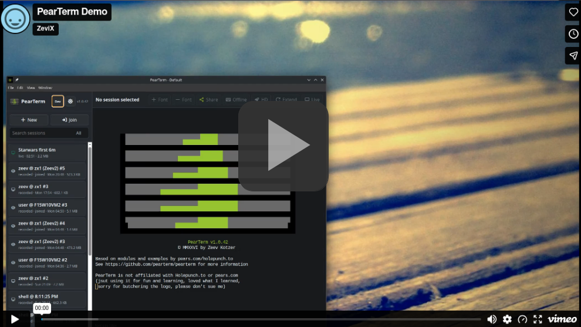
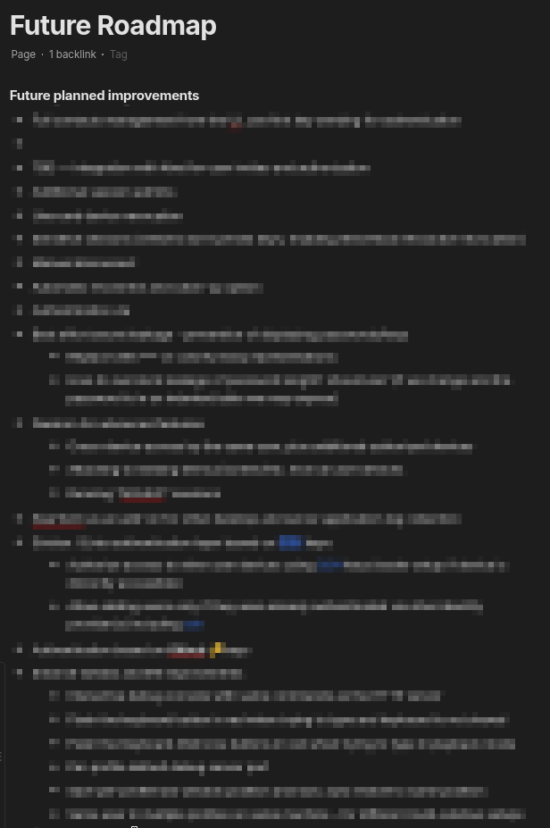

<p align="center">
  
</p>
<h1 align="center">ZBTerm</h1>
<h3 align="center">Secure terminal recording, playback and peer-to-peer sharing</h3>
<h3 align="center">built on the Pear/Electron stack</h3>

<p align="center">
  <a href="https://vimeo.com/1209702239">
  
  </a>
</p>


## Hilights
- Interactive PTY-backed shells, with encrypted terminal output recorded to a
  local session catalog and played back with a scrubber.
- Peer-to-peer live sharing of a running terminal (host and one or more
  viewers) over Hyperswarm, with per-link permission caps and optional relay
  fallback for NAT traversal.
- A localhost REST API for debugging and automation.

ZBTerm uses [Hypercore](https://docs.pears.com/reference/building-blocks/hypercore/)/[Hyperbee](https://docs.pears.com/reference/building-blocks/hyperbee/) for encrypted session history
storage and [Hyperswarm](https://docs.pears.com/reference/building-blocks/hyperswarm/) for real-time peer-to-peer communication,
demonstrating the power, extreme performance, simplicity and versatility of
the Pear/Bare platform.

Note: ZBTerm is not affiliated with Holepunch.to or pears.com

For detailed architecture see [docs/ARCHITECTURE.md](docs/ARCHITECTURE.md)

## Current version status

### Implemented
- Multiple profiles for sharing on the same machine (great for testing)
- Multiple active sessions that can be switched between
- Single-user invitation key (no approval required)
- Multi-user invitation key (approval required; no real guarantee of viewer identity)
- Keyboard sharing for all users — off by default, toggleable by the host
- Time slider with activity indicators for going back in time
- New viewers see the live view immediately; history downloads in the background with a visual indicator
- Host can look back through history while viewers keep watching the live output
- High-res mode for more frequent screen updates, togglable at any time
- Encryption of data at rest and in transit
- Ended sessions can be extended at any time by the host
- Key rotation on user join and exit
- Debugging and instrumentation REST server for e2e tests and live debugging

### Half-baked / unexposed features
- Role-based authorization (unused except for keyboard access)
- Multi-device support (unused)
- Headless relay service for cloud hosting — fallback for network configurations that aren't P2P-friendly

### Future Roadmap

Managed in Zeev's [private notes](anytype://object?objectId=bafyreia2xdux2xrhiftnqgpxaybeebohbqctnu3f5u5d45xxb24lf6gd3m&spaceId=bafyreiddaaox2eyyzic63ltzskr6jo2yxrprxysqvea6utb4foiqaqvjpm.33b9b642zrs9q)



## Table of Contents

- [Install & Run](#install-run)
  - [Install from npm](#install-npm)
  - [Linux desktop integration](#install-desktop)
  - [Updating](#install-update)
  - [Prerequisites (Linux)](#install-prereqs)
  - [Run from a clone (development)](#install-dev)
- [Storage](#storage)
- [Sharing](#sharing)
  - [Link Options](#link-options)
  - [Permission Caps](#permission-caps)
  - [NAT Traversal & Relay Fallback](#relay-fallback)
  - [Freenet](#freenet)
- [Setting Up a Relay (Headless VPS)](#relay-setup)
  - [1. Run the relay](#relay-run)
  - [2. Publish it to the registry](#relay-publish)
  - [3. Firewall](#relay-firewall)
  - [Rotating or replacing the relay](#relay-rotate)
  - [Abuse considerations](#relay-abuse)
- [Debug Server](#debug-server)
  - [Endpoints](#debug-endpoints)
- [Environment Variables](#env-vars)
- [CLI Flags](#cli-flags)

## Install & Run <a name="install-run"></a>

### Install from npm <a name="install-npm"></a>

```sh
npm install -g zbterm
zbterm                     # start the app
zbterm --help              # CLI flags
zbterm doctor              # check this machine can actually run it
```

`zbterm doctor` is the first thing to run if anything looks wrong: it reports
Node, the Electron binary, `node-pty`, the Bare sidecar prebuild, the data
directory, `$DISPLAY` and the Chromium sandbox, and exits non-zero when
something is genuinely broken. Add `--json` for machine-readable output.

#### Linux desktop integration <a name="install-desktop"></a>

An npm install does not register a desktop entry or a URL handler by itself.
On Linux, run this once after installing — otherwise ZBTerm will not show up
in your launcher and `zbterm://` share links will not open:

```sh
zbterm install-desktop     # .desktop entry, icons, zbterm:// handler
zbterm uninstall-desktop   # remove all of the above
```

#### Updating <a name="install-update"></a>

```sh
npm install -g zbterm@latest   # or:
zbterm update                  # prints the same command after checking npm
```

npm installs **do not use the Pear OTA updater**. The OTA path only applies to
Pear-distributed builds; an npm install checks the npm registry for a newer
version and tells you to run `npm install -g zbterm@latest`. Installers built
with electron-forge (deb/rpm/AppImage/flatpak/snap/dmg/msix) are a third,
separate distribution channel and are unaffected by either.

> **2026-09-19 — the Pear OTA updater is gone (`D-08`).** No build of ZBTerm has a Pear OTA
> updater any more, so there is no "Pear-distributed" update path to contrast with. An npm
> install still checks the npm registry and tells you to run `npm install -g zbterm@latest`,
> exactly as described above. An installer build has no update channel: install a newer package
> to update.

#### Prerequisites (Linux) <a name="install-prereqs"></a>

`node-pty` is a native module and is compiled from source when no prebuilt
binary matches your platform, so a global install needs a build toolchain:

- **python3**
- **make**
- a C++ toolchain — `build-essential` on Debian/Ubuntu,
  `@development-tools` / `gcc-c++` on Fedora/RHEL, `base-devel` on Arch

The install also downloads an **Electron runtime of roughly 150 MB**, so the
first `npm install -g zbterm` is not quick. Behind a proxy or on a restricted
network, point that download at a mirror:

```sh
ELECTRON_MIRROR=https://npmmirror.com/mirrors/electron/ npm install -g zbterm
```

If the Electron download was skipped or interrupted, `zbterm doctor` says so
and `npm rebuild electron` fixes it. If Electron is already installed
elsewhere, set `ELECTRON_OVERRIDE_DIST_PATH` to the directory holding the
binary.

### Run from a clone (development) <a name="install-dev"></a>

```sh
npm install
npm test
npm start
```

Development builds keep the Pear OTA updater wiring intact, but `npm start`
passes `--no-updates` by default — see the development appendix in
[`docs/ARCHITECTURE.md`](docs/ARCHITECTURE.md) if you need to work with
staged/provisioned/multisig builds.

> **2026-09-19 (`D-08`).** There is no Pear OTA updater wiring left in any build, development
> ones included. `npm start` still passes `--no-updates`; the flag is accepted and has no effect.

If your headless Linux environment has GPU issues:

```sh
npm start -- --disable-gpu
```

**Install scripts and `allowScripts`.** `package.json` pins
`allowScripts: { "electron@40.10.1": true }` while npm resolves a newer patch
release of Electron, so every `npm install` prints an
`allow-scripts … not yet covered by allowScripts` warning about
`electron@40.10.x` and `node-pty`. That warning is expected. What actually
lets the Electron and `node-pty` install scripts run is the **repo-local
`.npmrc`**, which sets `ignore-scripts=false` — so installing this repo from a
different working directory silently skips the Electron binary download and
leaves you with a `zbterm` that cannot start. Always run `npm install` from
the repo root.

**Changing the logo.** [`renderer/logo-ascii.js`](renderer/logo-ascii.js) is the
single source of truth for the mark: a grid of cells (`.` background, `-`
scanline grey, `G` accent green) plus the palette in `STARTUP_LOGO_COLORS`. The
terminal splash draws it directly. Edit it, then run:

```sh
npm run icons
```

That regenerates every other form of the logo — the vector
[`renderer/logo.svg`](renderer/logo.svg), and from it the Linux hicolor PNGs in
`build/icon/`, the 512px master `build/icon.png`, the Windows `build/icon.ico`
and the macOS `build/icon.icns`. None of those are edited by hand. Palette
colours are read out of `STARTUP_LOGO_COLORS` rather than hardcoded, so a
recoloured logo propagates on its own. `npm run logo` prints the result in your
terminal. Building the `.ico` needs ImageMagick (`magick`); everything else
needs only the `sharp` devDependency.

## Storage <a name="storage"></a>

The app stores local data under Electron `userData`:

- `zbterm/corestore/` — per-session encrypted Hypercore logs and metadata
- `zbterm/catalog/` — local session catalog
- `zbterm/snapshots/<sessionId>/` — encrypted local playback snapshots

Use `--profile <id-or-name>` / `--profile-path <dir>` (or `ZBTERM_PROFILE` /
`ZBTERM_PROFILE_PATH`) to run multiple isolated profiles side by side, or
`--storage <dir>` to point `pear-runtime` at custom storage entirely.

> **2026-09-19 (`D-08`).** `pear-runtime` is no longer a dependency. `--storage <dir>` still
> names ZBTerm's own data root (`electron/main.js::pearDataRoot`).

Only one instance can be opened per profile, when starting the app where another instance exist and not specifying a profile, the app will prompt you to select or create a profile

## Sharing <a name="sharing"></a>
  
A host creates a share link for a live session (`share.createLink`); a viewer
joins it (`share.join`). Both sides connect over a Hyperswarm topic derived
from the link, dial the host's DHT public key directly, and speak an
encrypted control protocol for join requests, approvals, terminal data, and
input. See [`docs/ARCHITECTURE.md`](docs/ARCHITECTURE.md) for how sharing
works internally.

### Link Options <a name="link-options"></a>

Passed to `share.createLink(sessionId, opts)` (and exposed via the debug
server's `POST /sessions/:sessionId/share`):

| Option        | Values                    | Default                    | Meaning |
| ------------- | ------------------------- | --------------------------- | ------- |
| `type`        | `'single'` \| `'group'`   | `'single'`                  | `single` links are consumed after one viewer joins; `group` links allow multiple concurrent viewers. |
| `maxViewers`  | integer                   | 1 (`single`) / 8 (`group`)  | Cap on concurrent viewers for a `group` link. |
| `autoJoin`    | boolean                   | `true`                      | Whether a join request is auto-approved or requires host approval (see `share:approval-pending`). |
| `caps`        | bitmask (see below)       | derived from other options  | Explicit permission bitmask; overrides the individual flags below if set. |
| `sendInput`/`input` | boolean             | `true`                      | Whether the viewer is granted `SEND_INPUT`. |
| `quickCatchup`| boolean                   | `true`                      | Whether the viewer gets a fast-forwarded backlog on join. |
| `admin`       | boolean                   | `false`                     | Grants `ADMIN` cap. |

### Permission Caps <a name="permission-caps"></a>

Permissions are a bitmask:

| Cap            | Bit | Meaning |
| -------------- | --- | ------- |
| `VIEW_LIVE`    | `1 << 0` | Can view the live terminal stream. |
| `READ_HISTORY` | `1 << 1` | Can read recorded history/backlog. |
| `QUICK_CATCHUP`| `1 << 2` | Gets fast-forwarded backlog instead of full replay. |
| `SEND_INPUT`   | `1 << 3` | Can send keystrokes to the shared session. |
| `ADMIN`        | `1 << 4` | Administrative capability (e.g. approvals). |

### NAT Traversal & Relay Fallback <a name="relay-fallback"></a>

Direct connections use Hyperswarm/hyperDHT hole-punching, which fails when
both peers sit behind the same NAT (e.g. two processes on the same home
network or the same physical machine's VM) or otherwise can't punch through.
For that case ZBTerm supports relaying the encrypted stream through a
third, publicly reachable box:

- The viewer's swarm waits `ZBTERM_RELAY_FALLBACK_MS` (default 5000ms) on a
  pure direct/hole-punch attempt before also offering a relay in parallel.
  Once offered, hyperdht races the relay and the punch concurrently and
  transparently swaps the live connection over to the direct path if the
  punch succeeds later — the relay is a fallback path, not a replacement.
- The relay's public key is *not* configured by the user. It's discovered
  automatically via a DHT mutable record — the Holepunch DHT's native
  equivalent of a DNS TXT record. The app ships with a fixed, hardcoded
  lookup address (not a secret) and resolves the current relay's key from it
  at startup, refreshing every 15 minutes.
- `ZBTERM_RELAY_PUBLIC_KEY` is an escape hatch: set it to skip the registry
  lookup and pin a specific relay (e.g. your own private one instead of the
  default).

Check `share.diagnostics()` (or `GET /share/diagnostics` on the debug server)
for `relayPublicKey` / `relayFallbackMs` to confirm what's resolved, plus
per-swarm connection/punch/relay stats for troubleshooting stuck joins.

### Freenet <a name="freenet"></a>

The default package also carries an experimental second network, Freenet. The share dialog lists
it beside Pear when more than one network is built in; pick it there. A Freenet share finds its
viewer through Freenet contracts, then connects the two machines directly over WebRTC.

ZBTerm does not install, start or update a Freenet node (`D-12`): it needs one already running
on the same machine, with its WebSocket API at `ws://127.0.0.1:7509` (the node's default; see
[freenet.org](https://freenet.org)). Without one, the share dialog shows Freenet as unavailable
with the reason "no Freenet node at ws://127.0.0.1:7509". Both host and viewer need their own node.

The direct connection asks STUN servers for each side's public address: by default
`stun:stun.l.google.com:19302` and `stun:stun.cloudflare.com:3478` (`D-11`). **Using Freenet
sharing discloses your IP address to that STUN provider.** Replace the list with the settings
menu's "STUN/TURN servers" field, `--ice-servers` or `ZBTERM_ICE_SERVERS` (comma-separated ICE
URLs; `turn:user:secret@host:port` for a TURN relay of your own), or turn STUN off with
`--ice-servers ''` (then only machines on one network connect). ZBTerm runs no TURN server;
when neither side can reach the other directly, the join fails with "Could not connect directly
to the host (ICE failed)".

## Setting Up a Relay (Headless VPS) <a name="relay-setup"></a>

You don't need to run a relay to use ZBTerm — the app resolves a default
one automatically. Run your own if you want a private fallback path instead
of the shared default. It needs to run on a box with a real public IP (a
VPS, not behind NAT) — a machine behind a router/CGNAT can't usefully act as
a relay for others.

### 1. Run the relay <a name="relay-run"></a>

`relay/server.js` is plain Node (no Electron), so you don't need a full app
checkout on the VPS. Either run it from a clone:

```sh
npm install
node relay/server.js
```

...or build a standalone executable (bundles its own Node runtime) and copy
just that one file to the box:

```sh
npm run build:relay              # this host's platform/arch
npm run build:relay -- --all     # linux/macos/win, x64 + arm64
npm run build:relay -- linux-x64 win-x64   # specific targets
```

Output goes to `out/relay/zbterm-relay-<version>-<platform>-<arch>` (e.g.
`zbterm-relay-1.0.19-linux-x64`), plus a matching
`zbterm-relay-registry-publish-<version>-<platform>-<arch>` for the
[registry publisher](#relay-publish) below. Each is a single self-contained
binary — no `node`, no `node_modules` needed on the target machine.

With no `ZBTERM_RELAY_SEED` set, it generates one and prints it once:

```
No ZBTERM_RELAY_SEED set - generated a new one:
  ZBTERM_RELAY_SEED=<64 hex chars>
ZBTerm relay listening on UDP port 49737
  ZBTERM_RELAY_PUBLIC_KEY=<64 hex chars>
```

Save `ZBTERM_RELAY_SEED` and pass it on every restart — it's the relay's
identity; without it, the relay gets a new public key each restart. Keep the
process running under systemd/pm2/similar.

Relevant env vars (all optional):

| Variable | Default | Meaning |
| -------- | ------- | ------- |
| `ZBTERM_RELAY_SEED` | random, printed once | 32-byte hex seed for the relay's identity keypair. |
| `ZBTERM_RELAY_PORT` | `49737` | Fixed UDP port to bind — pin this so you have one deterministic port for the firewall rule. |
| `ZBTERM_RELAY_MAX_SESSIONS` | `64` | Global cap on concurrent accepted connections. |
| `ZBTERM_RELAY_MAX_SESSIONS_PER_PEER` | `4` | Cap on concurrent sessions from a single remote identity. |
| `ZBTERM_RELAY_MAX_SESSION_MS` | `21600000` (6h) | Force-closes any single relayed session past this duration. |

The relay logs accept/reject/timeout events and a periodic stats summary
(active sessions, matched/pending pairings, active streams) every 5 minutes.
It never sees decrypted terminal data — it only forwards the already
noise-encrypted stream between two peers.

### 2. Publish it to the registry <a name="relay-publish"></a>

For ZBTerm clients to discover your relay automatically, publish its
public key to the DHT registry record clients look up:

```sh
ZBTERM_REGISTRY_SEED=<registry-secret> node relay/registry-publish.js <relay-public-key-from-step-1>
```

`ZBTERM_REGISTRY_SEED` is the secret that controls what the registry
record points at — treat it like a password, never commit it, and don't put
it in the app. It's separate from `ZBTERM_RELAY_SEED`. The script
re-publishes every 20 minutes (DHT-stored records aren't permanent) and,
on restart, reads back the current `seq` before continuing, so a restart
doesn't get shadowed by a stale higher-seq record. Keep it running alongside
`relay/server.js`.

If you'd rather not touch the shared default registry at all, skip this step
and instead set `ZBTERM_RELAY_PUBLIC_KEY` directly on your ZBTerm
host/viewer processes, pointing at your relay's public key from step 1.

### 3. Firewall <a name="relay-firewall"></a>

Only `relay/server.js` needs anything opened — it's the one process in this
setup that must be dialable from the internet:

- Open **inbound UDP** on the port from step 1 (`49737` by default) on the
  VPS's OS firewall (`ufw`/`iptables`/`firewalld`).
- If there's a separate cloud security-group layer (AWS/GCP/DigitalOcean/
  Hetzner console etc.), open the same UDP port there too — it's a different
  firewall from the OS one.

`relay/registry-publish.js` needs **no firewall changes** — it only makes
outbound DHT queries, like any regular ZBTerm client.

### Rotating or replacing the relay <a name="relay-rotate"></a>

Run a new `relay/server.js` with a new seed, then re-run
`registry-publish.js` with the new public key (same `ZBTERM_REGISTRY_SEED`
as before — that's what lets you point the registry at a different relay
without shipping an app update). Clients pick up the change on their next
15-minute refresh.

### Abuse considerations <a name="relay-abuse"></a>

The relay's public key is not a secret — anyone who reads the app source or
watches DHT traffic can find it (either the default one, or yours if you
run your own). The underlying `blind-relay` protocol pairs any two peers
that present a matching token; it has no concept of "is this a ZBTerm
client" by itself. `relay/server.js`'s `ZBTERM_RELAY_MAX_SESSIONS*` /
`ZBTERM_RELAY_MAX_SESSION_MS` caps bound the worst case (how many
connections, from how many identities, for how long) and log activity, but
they don't prevent unrelated use of your relay — that would need a
capability-ticket system tying relay usage to genuine ZBTerm invites,
which isn't implemented yet. If you're running a relay for wider-than-personal
use, keep an eye on the stats log.

## Debug Server <a name="debug-server"></a>

For local automation and debugging, start a localhost REST API with:

```sh
npm start -- --debug-server
```

Listens on `http://127.0.0.1:17077` by default (`--debug-server-port <port>`
or `ZBTERM_DEBUG_SERVER_PORT` to change it). All routes except a few
renderer/popup ones require the engine to be initialized.

```sh
curl -s -X POST http://127.0.0.1:17077/sessions \
  -H 'content-type: application/json' \
  -d '{"name":"debug shell","cols":100,"rows":30}'

curl -s -X POST http://127.0.0.1:17077/sessions/current/input \
  -H 'content-type: application/json' \
  -d '{"text":"pwd","enter":true}'
```

### Endpoints <a name="debug-endpoints"></a>

| Method & Path | Notes |
| -------------- | ----- |
| `GET /health` | Engine/renderer readiness, identity, popups. |
| `GET /identity` | Local device identity. |
| `GET /events` | Recent debug event log. |
| `GET /renderer/terminal-display` | Renderer terminal rows, dimensions, and row visibility geometry. |
| `GET /share/diagnostics` | Relay/swarm diagnostics — see [NAT Traversal & Relay Fallback](#relay-fallback). |
| `GET /account/profile` \| `/account/devices` \| `/account/local-device` | Account/device info. |
| `GET /sessions` | List sessions (`?query=`, `?activeOnly=true`). |
| `POST /sessions` | Create a session (`name`, `cols`, `rows`). |
| `GET /sessions/current` | Currently selected debug session. |
| `POST /sessions/current/input` | Send input to the selected session. |
| `GET /sessions/:sessionId` | Session summary. |
| `POST /sessions/:sessionId/switch` | Select a session (without opening it live). |
| `POST /sessions/:sessionId/live` | Open a session live (pauses playback if needed). |
| `POST /sessions/:sessionId/extend` | Resize/extend a session. |
| `POST /sessions/:sessionId/input` | Send input to a specific session. |
| `POST /sessions/:sessionId/resize` | Resize (`cols`, `rows`). |
| `POST /sessions/:sessionId/share` | Create a share link — see [Link Options](#link-options). |
| `GET /sessions/:sessionId/shares` | List share links for a session. |
| `DELETE /sessions/:sessionId/shares/:linkId` | Revoke a share link. |
| `POST /sessions/:sessionId/approvals/:requestId/approve` \| `/deny` | Approve/deny a pending join request. |
| `GET /sessions/:sessionId/stats` | Session stats. |
| `POST /sessions/:sessionId/playback/open` \| `/seek` \| `/play` \| `/pause` \| `/step` | Playback controls. |
| `POST /join` | Join a share link by URI (`{"uri": "zbterm://join/..."}`). |
| `POST /invoke` | Call any `engine.invoke(method, args)` method directly, e.g. `{"method":"share.diagnostics"}`. |
| `GET /popups` \| `POST /popups/:popupId/actions/:action` | Renderer popup inspection/control. |
| `GET /renderer/layout` | Renderer layout snapshot. |
| `GET /sessions/:sessionId/input/diagnostics` | Input pipeline diagnostics. |

## Environment Variables <a name="env-vars"></a>

| Variable | Used by | Meaning |
| -------- | ------- | ------- |
| `ZBTERM_PROFILE` | app | Profile id or name to open (same as `--profile`). |
| `ZBTERM_PROFILE_PATH` | app | Explicit profile data directory (same as `--profile-path`). |
| `ZBTERM_BACKEND` | app, Tabby plugin (archived 2026-09-19, see the note under this table) | Limit network sharing to one backend: `pear`, `freenet`, or `none` for a local-only run with no share or join (same as `--backend`, which wins). It only narrows what the build carries. Default: no limit. |
| `ZBTERM_BUILD_BACKENDS` | `electron-forge package` / `make` (`forge.config.js`) | Build variant: which share backends the package carries. ~~`pear` (default), `freenet`, `pear,freenet` or `none`.~~ Corrected 2026-09-24 (`D-14`): `pear`, `freenet`, `pear,freenet` (default) or `none`; see the note under this table. An absent backend loses its `engine/backends/<id>/` directory and its own dependencies, and the package's `package.json` records the list as `zbtermBackends`. With `none` the app hides Share, Join and the keyboard-sharing button and answers a join link with a notice; recording and playback are unchanged. ~~`hyperswarm` and `hyperdht` still ship in every variant, because the OTA updater (`workers/main.js`, `pear-runtime`) uses them.~~ Corrected 2026-09-19 (`D-07`): only a variant with `pear` has the OTA updater; see the note under this table. An unknown value fails the build. |
| `ZBTERM_FORGE_OUT_DIR` | `electron-forge package` / `make` (`forge.config.js`) | Directory the package is written to instead of `out/`, e.g. to build a variant without replacing the packages already in `out/`. Default: `out`. |
| `ZBTERM_ICE_SERVERS` | app (main process) | STUN/TURN servers for Freenet's direct connections: comma-separated ICE URLs (`stun:host:port`, `turn:user:secret@host:port`); an empty value means none (host candidates only). `--ice-servers` wins over it, and a non-empty "STUN/TURN servers" setting wins over both. Default: `stun:stun.l.google.com:19302,stun:stun.cloudflare.com:3478` (`D-11`). The STUN provider sees your IP address; see [Freenet](#freenet). |
| `ZBTERM_INVITE_V2` | core (`engine/invite.js`) | `1` makes Pear share links use the v2 invite shape (`b`, `peer`, `route`) while keeping the v1 fields beside it. Default: off, so Pear links stay v1 and released builds can join them. A link for any other backend is always v2. Read each time a link is made. The core runs in a Bare worker whose environment is not reliably inherited from the app, so treat it as a development switch. |
| `ZBTERM_ELECTRON_USER_DATA` | app | Custom Chromium/Electron user data dir. |
| `ZBTERM_DEBUG` | app | `1` enables verbose packaged debug logging (same as `--debug`). |
| `ZBTERM_DEBUG_SERVER` | app | `1` starts the debug REST API (same as `--debug-server`). |
| `ZBTERM_DEBUG_SERVER_PORT` | app | Port for the debug REST API. |
| `ZBTERM_DEVTOOLS` | app | `1` opens renderer devtools on startup (same as `--devtools`). |
| `ZBTERM_RELAY_PUBLIC_KEY` | app (viewer/host) | Pin a specific relay instead of resolving one via the registry. |
| `ZBTERM_RELAY_FALLBACK_MS` | app (viewer) | Delay before racing a relay connection alongside hole-punching. Default `5000`. |
| `ZBTERM_RELAY_SEED` | `relay/server.js` | Relay's identity seed. |
| `ZBTERM_RELAY_PORT` | `relay/server.js` | Fixed UDP port to bind. Default `49737`. |
| `ZBTERM_RELAY_MAX_SESSIONS` | `relay/server.js` | Global concurrent session cap. Default `64`. |
| `ZBTERM_RELAY_MAX_SESSIONS_PER_PEER` | `relay/server.js` | Per-identity concurrent session cap. Default `4`. |
| `ZBTERM_RELAY_MAX_SESSION_MS` | `relay/server.js` | Max lifetime of a single relayed session. Default 6h. |
| `ZBTERM_REGISTRY_SEED` | `relay/registry-publish.js` | Secret controlling the DHT registry record. |

> **2026-09-19 — which builds have OTA updates (`D-07`).** Only a packaged build that carries
> the Pear backend (`ZBTERM_BUILD_BACKENDS` with `pear`, which is the default) has the Pear OTA
> updater. A `freenet` or `none` package ships no `workers/main.js`, `pear-runtime`,
> `pear-runtime-updater`, `corestore`, `hyperswarm` or `hyperdht`; it runs exactly as with
> `--no-updates`, logs one `[updater] updates unavailable: …` line at start, never shows the
> update button, and has no replacement update channel: install a newer package to update. npm
> installs are unchanged: they never used the OTA updater (see [Updating](#install-update)).

> **2026-09-19 — no build has OTA updates (`D-08`, supersedes the note above).** The Pear OTA
> updater was removed from every build, the default `pear` one included: `workers/main.js`,
> `electron/updater-available.js`, `pear.json`, `package.json#upgrade` and the `pear-runtime` and
> `corestore` dependencies are gone, and the `[updater] updates unavailable` line is no longer
> logged. `ZBTERM_BUILD_BACKENDS` now decides only whether the package carries
> `engine/backends/pear/` with `hyperswarm` and `hyperdht`. `--no-updates` is still accepted, for
> existing launchers, and does nothing. The npm registry check is unchanged.

> **2026-09-19 — the Tabby plugin is archived.** `tabby-plugin/` moved to
> [`archive/tabby-plugin/`](archive/tabby-plugin/) and its plan and changelog to
> `archive/tabby-plugin/docs/` (see [`archive/README.md`](archive/README.md)). It is not built,
> tested, linted or packaged any more, so "Tabby plugin" as a consumer of `ZBTERM_BACKEND`
> describes archived code. The variable's meaning for the app is unchanged.

> **2026-09-28.** `archive/` was not carried into this repository (`Z1` of
> `docs/projects/260928_zbterm-fork/`); the two links just above do not resolve here. The files
> they named stay readable in the predecessor repository, frozen at its final commit `b856e15`
> (see `docs/projects/README.md`).

> **2026-09-24 — the Freenet development switch is gone (freenet-backend F3).** Its row, the
> variable that made the Freenet **stub** report itself `available`, was removed from this table.
> The Freenet backend is now a real node client, and nothing reads that variable:
> `share.backends` lists `freenet` as `broken` / `not yet wired` in every build until its sharing
> path is wired (phase F9 of `docs/projects/260924_freenet-backend/`).

> **2026-09-24 — Freenet ships by default (freenet-backend F9, `D-14`).** The default package is now
> `pear,freenet`: `forge.config.js::DEFAULT_BUILD_BACKENDS`, and a default package carries
> `engine/backends/freenet/` (with its two contract `.wasm` files), `@freenetorg/freenet-stdlib`,
> `bs58`, `bare-ws`, `bare-encoding`, `node-datachannel` and `THIRD-PARTY-NOTICES.md`; `pear` and
> `none` leave all of them out. `share.backends` no longer says `not yet wired`: `freenet` is
> `available` when a Freenet node answers at `ws://127.0.0.1:7509`, and `broken` with "no Freenet
> node at ws://127.0.0.1:7509" otherwise (see [Freenet](#freenet)).

## CLI Flags <a name="cli-flags"></a>

| Flag | Meaning |
| ---- | ------- |
| `--storage <dir>` | Custom storage dir passed to `pear-runtime`. Default: app user data dir. |
| `--profile <id-or-name>` | Open a specific ZBTerm profile by id or name. Default: auto-select the default profile when possible, otherwise show the picker. |
| `--profile-path <dir>` | Open an explicit ZBTerm profile data directory. Default: none. |
| `--backend <pear\|freenet\|none>` | Limit network sharing to one backend, or `none` for local-only. It only narrows what the build carries. Default: every backend in this build. |
| `--ice-servers <list>` | STUN/TURN servers for Freenet's direct connections, comma-separated ICE URLs; `''` for none (host candidates only). Wins over `ZBTERM_ICE_SERVERS`; a non-empty "STUN/TURN servers" setting wins over it. Default: Google and Cloudflare STUN (`D-11`). |
| `--no-updates` | Start without OTA updates. Default: updates enabled; `npm start` passes `--no-updates` for development. |
| `--debug` | Enable verbose packaged debug logging. Default: off. |
| `--debug-server` | Start the localhost debug REST API. Default: off. |
| `--debug-server-port <port>` | Port for `--debug-server`. Default: `17077`. |
| `--devtools` | Open renderer developer tools on startup. Default: off. |
| `--disable-gpu` | Start without Chromium GPU acceleration (useful headless). Default: GPU enabled. |
| `--help` | Print CLI flag help and exit without starting the UI. |

> **2026-09-19 (`D-08`).** Two rows above are out of date. `--no-updates`: accepted for
> compatibility and has no effect; there are no OTA updates to turn off. `--storage <dir>`:
> ZBTerm's own data directory; nothing is passed to `pear-runtime`, which is no longer a
> dependency.

## For Developers

Internals, design rationale, build/packaging scripts, and the OTA release
flow are documented in [`docs/ARCHITECTURE.md`](docs/ARCHITECTURE.md).

Cutting an npm release — the pre-publish checks, the version policy against
the Pear `upgrade` key, the per-platform manual matrix, and how to deprecate a
bad version — is documented in [`docs/RELEASE-NPM.md`](docs/RELEASE-NPM.md).

> **2026-09-19 (`D-08`).** There is no OTA release flow and no Pear `upgrade` key any more; both
> documents carry a dated note where they describe one.

### Building, signing and store submissions <a name="building-signing"></a>

Local packaging (no distribution, no signing needed):

```sh
npm run package                        # → out/ZBTerm-<platform>-<arch>/
npm run make                           # → installers in out/make/
ZBTERM_FORGE_OUT_DIR=<dir> npm run make  # write into a scratch dir instead of out/
./build_all.sh                         # relay executables (all platforms) + GUI package (all
                                        # platforms) + GUI installers (host platform only)
```

Signed, distributable builds are cut by the `Build Release` GitHub Actions
workflow (manual dispatch), gated on a `release` environment holding these
secrets:

| Secret | Platform | Notes |
| ------ | -------- | ----- |
| `CERTIFICATE_P12` / `CERTIFICATE_PASSWORD` | `darwin` | Base64 `.p12` export + its password. |
| `MAC_CODESIGN_IDENTITY` | `darwin` | e.g. `Developer ID Application: Name (TEAMID)`. |
| `APPLE_ID` / `APPLE_PASSWORD` / `APPLE_TEAM_ID` | `darwin` | Notarization (app-specific password, not the account one). |
| `WINDOWS_CERT_PFX_BASE64` / `WINDOWS_CERT_PASSWORD` | `win32` | Base64 `.pfx` export + its password. |

macOS signing needs an Apple Developer Program membership; the Windows
certificate's subject must match `Publisher` in
[`build/AppxManifest.xml`](build/AppxManifest.xml). Linux builds are unsigned.
The same macOS variables, set locally, sign a local `npm run make` too.

**Flatpak.** The manifest lives at
[`flatpak/net.z33v.zbterm.yml`](flatpak/net.z33v.zbterm.yml) and
[`flatpak/net.z33v.zbterm.metainfo.xml`](flatpak/net.z33v.zbterm.metainfo.xml).
To build and test it locally:

```sh
sudo apt install flatpak
flatpak remote-add --if-not-exists --user flathub https://dl.flathub.org/repo/flathub.flatpakrepo
flatpak install flathub org.flatpak.Builder
npm run make                                    # produces the tarball the manifest's source points at
python3 -m http.server --directory out/make/    # serve it for the manifest's local:// / http:// source
cd flatpak
flatpak run --command=flathub-build org.flatpak.Builder --disable-rofiles-fuse net.z33v.zbterm.yml
flatpak install --user ./repo net.z33v.zbterm
flatpak run net.z33v.zbterm
```

Uninstall with `flatpak uninstall net.z33v.zbterm && rm -rf ~/.var/app/net.z33v.zbterm`; clear
`builddir repo .flatpak-builder` under `flatpak/` if a rebuild takes too much disk. Submitting to
Flathub means updating the manifest's source URLs/sha512 to a real, versioned download location
and opening a PR against [flathub/flathub](https://github.com/flathub/flathub) — see that
project's own submission docs for the current process.

**Snap.** `npm run make` on Linux also produces a `.snap` (via
`pear-electron-forge-maker-snap`, which fixes the base, confinement and app
command — see `agent_docs/packaging.md` for what it overrides). Install it
locally with `snap install out/make/*.snap --devmode`; publishing needs a
registered Snap name and `snapcraft login`/`snapcraft upload` — see
[Snapcraft's publishing docs](https://documentation.ubuntu.com/snapcraft/).

### Remote test host

The Freenet backend is tested against a network-mode Freenet node on a remote machine. The
fabric recipe [`scripts/infra/freenet_host.py`](scripts/infra/freenet_host.py) provisions one
(the pinned `freenet`/`fdev` release, Node.js 24.x and a `freenet-node` systemd unit, everything
under `~/work/zbterm`) and pushes `spikes/freenet/` to it; its docstring lists what it writes
where. Debian is tested, Fedora is untested.

```
PYTHONPATH=/ubitron/dev /zp/zdata/work/ubitron/dev/.venv/bin/python scripts/infra/freenet_host.py HOST
PYTHONPATH=/ubitron/dev /zp/zdata/work/ubitron/dev/.venv/bin/python scripts/infra/freenet_host.py HOST --task sync
```

`--task repo` pushes this working tree to `~/work/zbterm/repo` (no `node_modules`, `.git`, `out`,
`archive`) and runs `npm ci` there, so `test/tools/freenet-remote-pair.js` can run one side of a
Freenet share on the remote host with the shipped backend code.

The Freenet contracts are Rust crates under `engine/backends/freenet/contracts/src/`; the app ships
their compiled `.wasm`, pinned by BLAKE3 in `contracts/hashes.json`. `bash
scripts/build-contracts.sh` rebuilds and re-pins them (cargo with the `wasm32-unknown-unknown` target,
`fdev` and Node on `PATH`). To check that a second machine builds the same bytes, `--task rust`
installs the pinned Rust toolchain under `~/work/zbterm/rust` and `--task contracts` pushes the
crates to `~/work/zbterm/contracts/`, where the same script runs.

## License

ZBTerm is open source under the
[Apache License, Version 2.0](LICENSE). You may use, run, modify and
redistribute it, including commercially, subject to the terms of that license.

Contributions are accepted under the same license, per Apache-2.0 §5.

The names "ZBTerm", "PassCall" and "PassCall Advanced Technologies", and the
associated icons, logos and visual identity, are trademarks of PassCall
Advanced Technologies Ltd. Apache-2.0 §6 grants no trademark rights, so a
redistributed fork should carry its own name and icons.

Third-party components (Electron, Chromium, Node.js, Bare, the Pear runtime,
node-pty, xterm.js, Font Awesome and others) remain under their own licenses.
