Note: ZBTerm is not affiliated with Holepunch.to or pears.com
# ZBTerm Architecture

## 1. Introduction

ZBTerm is a secure terminal recording, playback, and peer-to-peer sharing
application. A host runs a local PTY-backed shell, records encrypted terminal
history into Hypercore, shares live output over Hyperswarm/HyperDHT, and
authorizes viewers by identity, device, link, capability, and epoch keys.

This document is the architecture reference for ZBTerm: the process
model, the storage and cryptographic design, the peer-to-peer protocol, and
the reasoning behind the less obvious decisions.

The design is driven by five requirements:

1. Terminal history must be encrypted at rest and during replication.
2. Live terminal output must be shareable over a peer-to-peer network.
3. Access must be controlled using identities, devices, capabilities, share
   links, and cryptographic epoch keys.
4. Sensitive networking, storage, and cryptographic operations must be
   isolated from the Electron application shell.
5. The system must remain compatible with the Pear and Bare runtimes.

The document walks through the system roughly in the order a request
travels: process model, the shell/worker seam, the engine API, storage,
identity and authorization, networking, session lifecycle, sharing,
cryptography, playback, crash recovery, and finally security boundaries,
tradeoffs, and non-goals.

### 1.1 Core Principles

- One running profile owns one core engine instance and one shared
  Hyperswarm/DHT identity.
- Electron is a shell. It owns windows, renderer IPC, the debug HTTP server,
  update worker lifecycle, and native PTY processes.
- The Bare worker is the core. It owns profiles, locks, account state,
  Corestore, crypto, session business logic, sharing, playback, and the shared
  Hyperswarm.
- `node-pty` stays in the Electron shell because it does not run under Bare.
  The core can request PTY operations only through the framed engine seam.
- Renderer contracts are stable: `zbterm:invoke(method, args)` and
  `zbterm:event` are the only two shapes the UI ever sees.
- Peer confidentiality is enforced by key distribution, not by socket access
  alone. Socket checks are still used as defense in depth.
- History is single-writer. The host is the only writer of canonical session
  log and metadata cores.

If you take one sentence from this document, take this one: ZBTerm keeps
the operating-system terminal in the Electron shell, puts the secure
distributed session engine in a Bare worker, and connects the two with a
narrow, ordered, binary protocol.

## 2. Process Model

### 2.1 The Three Runtime Domains

ZBTerm is split into three runtime domains, each with an intentionally
narrow job: the renderer presents, the shell connects, and the worker
controls.

**The renderer** is the user-interface layer. It uses xterm.js to display
terminal output and presents session lists, sharing dialogs, playback
controls, profile controls, and status information. The renderer does not
directly access the file system, cryptographic keys, peer-to-peer sockets, or
terminal processes; it communicates exclusively through a preload bridge that
exposes a stable `zbterm:invoke(method, args)` command API and a
`zbterm:event` event stream. This stable interface allows the internal
architecture to change without a redesign of the user interface.

**The Electron main shell** is treated as a shell around the core engine. It
owns the application windows, Electron renderer IPC and the preload
integration, the loopback debug HTTP server, supervision of the Bare worker
and of the application update worker, and — most importantly — the native
pseudo-terminal processes provided by `node-pty`. Because `node-pty` cannot
run inside the Bare worker, terminal process creation must remain in the
shell. The shell, however, owns no terminal session business logic: it does
not decide how sessions are encrypted, does not own session metadata, does
not own the peer-to-peer swarm, and does not authorize viewers. It provides
a controlled native terminal capability to the worker, nothing more. In
short: the shell owns the terminal process handle; the worker owns the
terminal session.

**The Bare core worker** is the architectural core. It owns the profile
manager and profile locks, account and device state, Corestore and Hypercore
data, session creation and lifecycle logic, encryption and key distribution,
the session catalog, playback, sharing, and one shared Hyperswarm instance
for the active profile. The main orchestrator inside the worker is the
`SessionEngine`, which exposes a single public command pattern — invoke a
method with arguments — used identically by the renderer, the debug server,
and any future entrypoint.

### 2.2 High-Level Block Diagram

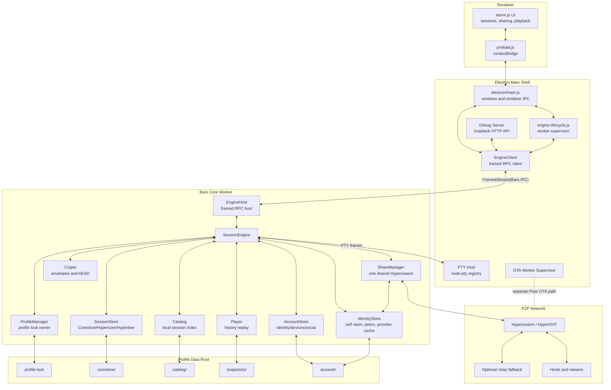

> **2026-09-19 (`D-08`).** The `OTA Worker Supervisor` node and its `separate Pear OTA path`
> edge no longer exist: the Pear OTA updater was removed from every build. The host supervises
> one Bare worker, the core's (`engine/worker.js`).

### 2.3 Process Topology

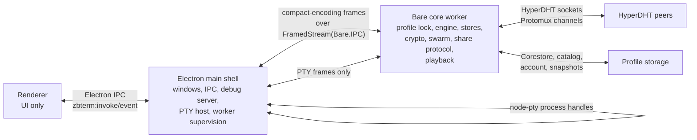

The shell never constructs `SessionEngine` in-process. It supervises
`engine/worker.js` (the `zbterm-core` sidecar entrypoint), restarts it on
crash or hang, and forwards renderer/debug requests through `EngineClient`.

The worker owns `ProfileManager` and therefore owns profile locks. This
avoids a shell-side lock model that would not generalize to future headless
entrypoints.

### 2.4 Component Responsibilities

| Component | Runtime | Responsibility |
| --- | --- | --- |
| Renderer | Electron renderer | xterm.js rendering, session UI, sharing dialogs, playback controls |
| Preload bridge | Electron renderer/shell boundary | Exposes stable `zbterm:invoke` and `zbterm:event` APIs |
| `electron/main.js` | Electron shell | Windows, app lifecycle, renderer IPC, shell-only commands |
| `engine-lifecycle.js` | Electron shell | Starts/stops/restarts the Bare worker and reports engine state |
| `EngineClient` | Electron shell | Encodes invokes, decodes replies/events, preserves renderer contract |
| Debug server | Electron shell | Loopback REST API using the same `EngineClient` seam as the renderer |
| PTY host | Electron shell | Owns `node-pty` instances and validates PTY frame session ownership |
| `EngineHost` | Bare worker | Decodes frames, dispatches invokes, emits events, requests PTY ops |
| `SessionEngine` | Bare worker | Main command/event API and orchestration |
| `ShareManager` | Bare worker | One shared Hyperswarm, link lifecycle, join/host protocol, relay lookup |
| Stores | Bare worker | Account, catalog, session Corestore, meta Hyperbee, snapshot cache |
| Player | Bare worker | Sparse history fetch, decrypt, seek, frame/data playback |

### 2.5 Rationale for the Split

The process split is primarily a security and portability decision. The
Electron shell holds powerful operating-system capabilities: it can create
processes, manage windows, and access Electron APIs. The Bare worker, in
contrast, is responsible for processing untrusted network traffic, parsing
peer messages, replicating data, and handling encryption. Keeping these
responsibilities separate reduces the number of capabilities available to
network-facing code.

If malformed or malicious peer traffic reaches the worker, that code does
not hold a general-purpose `node-pty` process-spawning interface, window
management, or Electron APIs; it can only send the defined PTY commands
through the internal protocol, and the shell performs them only against
sessions it already knows. To be clear about what this does and does not
buy: a fully compromised worker can still write input to existing PTY
sessions — which on a live shell is code execution — so the split is not a
sandbox for the worker. It narrows the interface that network-facing code
exposes, so that a parsing bug is less likely to hand an attacker arbitrary
capabilities directly, and it keeps that attack surface out of the Electron
process itself.

The split also supports future non-Electron entrypoints: because the
`ProfileManager` and profile locks live in the worker, a future headless
application can run the same core without reproducing shell-specific profile
ownership logic.

### 2.6 Core Boundary

The core is `engine/`, which is also the `zbterm-core` npm package: its own
`package.json`, its own version, its own `imports` map, the Bare sidecar
entrypoint `engine/worker.js`, and the host-side supervisor `engine/client.js`.
The contract it publishes is frozen in `docs/CORE-CONTRACT.md` and
`test/core-contract.test.js` fails the build when the two drift. (`workers/`
keeps only `main.js`, the app's OTA updater, which is not core.) It contains no
host-specific code: no `node-pty`, no `electron`, no process spawning, and no
require that resolves into `electron/`, `renderer/`, or `bin/`. The core owns
*interfaces*; a host supplies the implementations by injection. This is what
makes a second host (a plugin, a headless CLI) possible without touching the
core, and `test/core-boundary.test.js` fails the build if it regresses.

> **2026-09-19 (`D-08`).** `workers/` no longer exists: `workers/main.js`, the OTA updater, was
> removed from every build. `test/core-boundary.test.js::CORE_DIRS` is `['engine']`.

Today there is exactly one such adapter contract, the **PTY host**. It is a
constructor option, not a require: `new SessionEngine({ ptyHost })` throws an
`EngineError` when it is missing rather than falling back to a local
implementation.

```
spawn(sessionId, { cols, rows, shell, cwd }) -> { write, resize, pause, resume, kill }
attach(sessionId, { cols, rows })            -> { write, resize, pause, resume, kill }
write(sessionId, data)
resize(sessionId, cols, rows)
pause(sessionId) / resume(sessionId)
kill(sessionId)
events: 'data' -> { sessionId, data: Buffer }
        'exit' -> { sessionId, exit: { code, signal } }
```

`attach()` is the optional half of the contract, for hosts that **already own**
a terminal (a Tabby tab, an SSH session someone else launched).
`createSession({ mode: 'attach' })` calls it instead of `spawn()`; a host that
does not implement it makes that call fail with `E_INTERNAL`. The handle it
returns has the same five methods and the same two events, deliberately - there
is no second interface - but three semantics differ:

- `kill()` **detaches**: the core lets go of the terminal, the host's terminal
  keeps running. `closeSession`, `deleteSession` and `close()` all go through
  it, so none of them can ever kill a terminal the core did not launch. The
  host then emits `exit`; if it reports no signal, the core records
  `signal: 'detached'` so the catalog says why the session ended.
- `resize()` is never called by the core. With viewers attached the host owns
  `cols`/`rows`; `resize(sessionId, cols, rows)` on the engine only *records*
  what the host reports, and rejects non-positive-integer geometry rather than
  writing it into the timeline, where it would corrupt playback permanently.
- `pause()` is advisory. The core still drives `pause()`/`resume()` at the
  flow limit, but a host that cannot honour them keeps pushing, so the core
  holds post-pause output in a per-session buffer capped at
  `ATTACH_BUFFER_LIMIT` (4 MiB), replays it when acks resume the flow, and
  past the cap drops it - counting the dropped chunks and bytes, warning once
  on `engine:error`, and reporting both in `engine.diagnostics(sessionId)`
  (`session.diagnostics` over the seam). Bounded, never unbounded.

Two implementations satisfy it. `electron/pty-host.js` is the real one: it owns
`electron/pty-session.js` (`node-pty`) and `electron/pty-scope.js` (the systemd
containment for each terminal), and the Electron shell injects it into the
`EngineClient`. `engine/pty-remote.js` is the worker-side proxy the Bare worker
injects: the same API, but every call becomes a `PTY_*` frame on the shell
seam, and inbound `PTY_DATA`/`PTY_EXIT` frames become the same two events. The
core cannot tell them apart, which is the point. Neither implements `attach()`
today - the Electron shell always launches its own terminals - and the frame
protocol has no `PTY_ATTACH` kind, so attach mode is currently for hosts that
embed the engine in-process. `test/engine-attach.test.js` exercises it against
a fake host that implements both halves.

Any new host capability the core needs - reading `~/.ssh`, HTTP for provider
key lookups - gets its own named adapter contract in this shape rather than a
direct require. Provider key lookup already works this way: the resolver emits
`identity:resolve-request` and the shell answers over the seam.

## 3. The Shell–Worker IPC Seam

The Electron shell and Bare worker communicate over a single duplex pipe. The
transport is a framed binary protocol over `FramedStream(Bare.IPC)`. JSON is
used only for method bodies and low-rate events; hot paths
use binary frames.

Every message is a frame with three fields: a frame kind, a numeric
identifier, and a binary body. The frame kind determines how the body is
interpreted; the numeric identifier connects a reply to the original
invocation, allowing multiple operations to be in progress concurrently over
the same pipe.

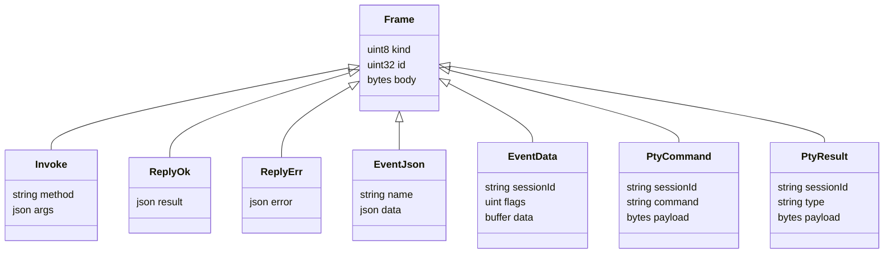

### 3.1 Frame Families

| Frame | Direction | Purpose |
| --- | --- | --- |
| `INVOKE` | shell to worker | The `engine.invoke(method, args)` contract |
| `REPLY_OK` / `REPLY_ERR` | worker to shell | Invoke completion or serialized `EngineError` |
| `EVENT_JSON` | worker to shell | Low-rate events such as list/share/status changes |
| `EVENT_DATA` | worker to shell | Binary `session:data` and `player:data` payloads |
| `PTY_SPAWN/WRITE/RESIZE/KILL/PAUSE/RESUME` | worker to shell | Core-controlled PTY operations |
| `PTY_DATA/EXIT` | shell to worker | PTY output and termination events |

*Invoke frames* carry a method name and arguments from shell to worker
(e.g. `session.create`, `share.join`, `player.open`); the worker dispatches
them to the `SessionEngine`.

*Event frames* are emitted by the worker without a pending request.
Low-frequency events — session-list changes, sharing status, join approval
requests, engine state changes, diagnostics — use structured JSON payloads.
High-frequency terminal data (`session:data`, `player:data`) uses binary
event frames, which avoids the processing and memory cost of converting
terminal bytes into base64 text or large JSON strings.

*PTY frames* implement the narrow terminal capability. Command frames
(spawn, write, resize, kill, pause, resume) travel from the worker to the
shell; result frames (output data, exit notifications) travel from the shell
to the worker. The worker addresses every PTY operation by session
identifier, and the shell maintains the actual `node-pty` registry and
confirms that operations refer to valid terminal sessions.

> **2026-09-24 (`projects/260924_freenet-backend`).** A fourth family was appended:
> `BACKEND_OPEN/SIGNAL/STATE/CHANNEL/DATA/FLOW/CLOSE`, `FrameKind` 15–21 (0–14 unchanged), which
> carry a share backend's WebRTC peer connections between the worker and the shell. See the
> dated paragraph under §7 and `docs/CORE-CONTRACT.md` §3.

### 3.2 Ordering: Why One Pipe

There is one duplex pipe, on purpose, and no separate fast lane for data. A
single ordered stream preserves the relative ordering of terminal data,
state events, replies, and lifecycle events: the renderer can never observe
a session-close event before terminal data that was emitted earlier. This is
much easier to reason about than reconciling two streams.

## 4. Engine API Surface

The public engine surface remains `invoke(method, args)`. The important
method families:

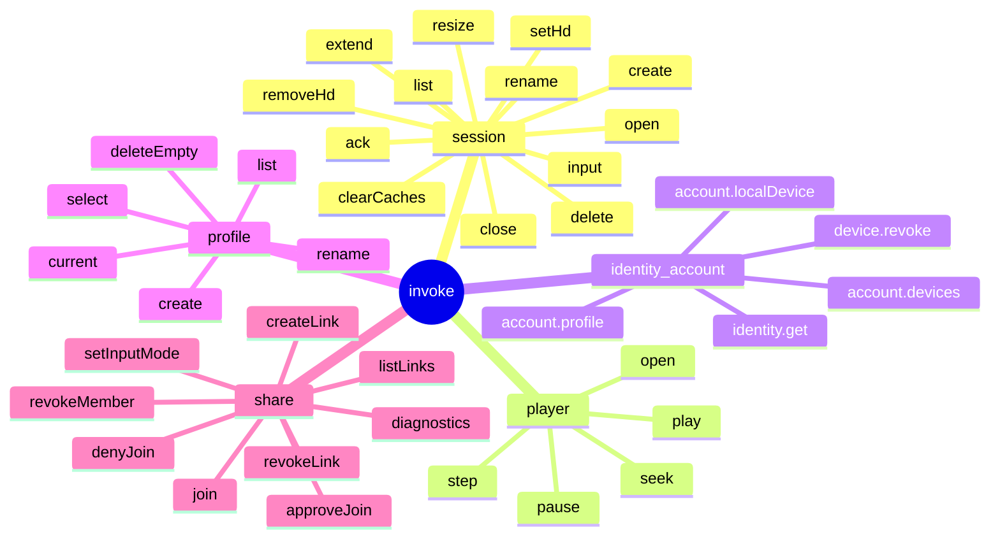

All of these operations are commands executed by the worker; the renderer
never manipulates stores, keys, peers, or terminal processes directly.
Worker-originated events remain renderer-facing `zbterm:event` messages.
Hot data events are binary across the shell/core seam and then forwarded to
the renderer in the standard event shape.

## 5. Data Model

### 5.1 Profile Model

A ZBTerm profile is the primary ownership boundary for local application
state. Each profile has its own profile lock, account data, Corestore,
session catalog, snapshot cache, and peer-to-peer identity.

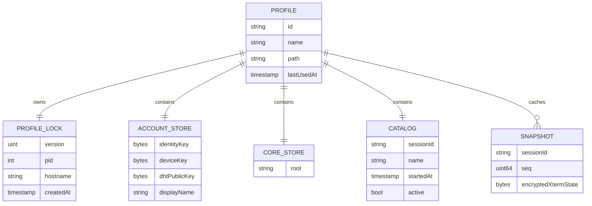

Profile storage shape:

```text
profiles/
  profiles.json
  <profileId>/
    lock
    account/
    corestore/
    catalog/
    snapshots/
```

Only one process may hold a profile lock at a time; this prevents two
application instances from writing to the same profile simultaneously.
Different profiles may run concurrently because they use separate locks and
separate storage roots. The lock records a format version, process
identifier, hostname, and creation time, and is owned by the worker — the
real owner of account state, stores, and the session engine.

### 5.2 Session Storage Model

Each terminal session has two principal replicated data structures, both
kept in a Corestore namespace: a Hypercore log containing the encrypted
terminal output history, and a Hyperbee store containing structured session
metadata. The host is the only writer of both canonical structures — the
single-writer rule. Viewers may replicate the data but never modify the
canonical history or metadata.

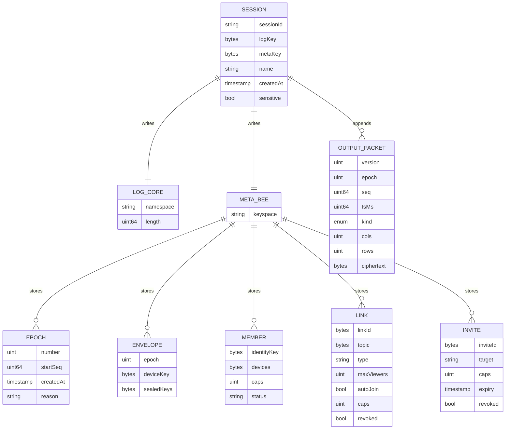

Terminal output is divided into *output packets*, each carrying a format
version, epoch number, sequence number, timestamp, packet kind, terminal
dimensions, and encrypted content. The `sessionId` is derived from the log
discovery key, binding the session identity to the underlying append-only
log.

The metadata Hyperbee stores cryptographic epochs (each identifying a key
generation: number, starting sequence, creation time, and rotation reason),
sealed key envelopes (encrypted session key material intended for one
specific device), members (authorized identities and their capabilities),
share links, and invitations.

## 6. Identity, Devices, and Authorization

### 6.1 Identity and Device Model

ZBTerm distinguishes between user identity and device identity. A user has
a long-term identity key and may have multiple devices; each device has its
own device key, which the identity attests belongs to the user. Each device
additionally owns a DHT keypair used for peer-to-peer Noise authentication
and envelope key material used to receive sealed cryptographic envelopes.

```mermaid
erDiagram
  USER_IDENTITY ||--o{ DEVICE : attests
  DEVICE ||--|| DHT_KEYPAIR : owns
  DEVICE ||--|| ENVELOPE_KEY : owns
  SESSION ||--o{ MEMBER : authorizes
  MEMBER ||--o{ DEVICE_ENVELOPE : receives

  USER_IDENTITY {
    bytes identityKey
    bytes mnemonicRoot
  }

  DEVICE {
    bytes deviceKey
    string deviceName
    string status
    bytes proof
  }

  DHT_KEYPAIR {
    bytes publicKey
    bytes secretKey
  }

  ENVELOPE_KEY {
    bytes publicKey
    bytes secretKey
  }

  MEMBER {
    bytes identityKey
    uint caps
    string status
  }

  DEVICE_ENVELOPE {
    uint epoch
    bytes deviceKey
    bool hasLiveKey
    bool hasHistoryKey
  }
```

This separation buys quite a lot: a new device can be added without
replacing the user's identity, a compromised device can be revoked on its
own, session key material can be encrypted separately for each authorized
device, and peer connections are authenticated with device-specific DHT
keys.

### 6.2 Capability-Based Authorization

Authorization is represented through capability bitmasks:

| Capability | Meaning |
| --- | --- |
| `VIEW_LIVE` | Can receive live terminal output |
| `READ_HISTORY` | Can decrypt recorded history for granted epochs |
| `QUICK_CATCHUP` | Can receive host-served snapshot/diff catchup |
| `SEND_INPUT` | Can send sealed input to the host PTY |
| `ADMIN` | Can approve/manage sharing actions that the host executes |

The capabilities are separable: one viewer may receive live output without
the history key; another may inspect historical output but not send input.
Separation is enforced cryptographically as well as logically — a device
that lacks a history key cannot decrypt history even if it obtains the
replicated encrypted log (see §10).

### 6.3 Provider-Backed Identity

The device and identity keys of §6.1 say that two connections come from the
same installation; they say nothing about *who* is on the other end. A
human-meaningful name has to come from somewhere the user already trusts, so
ZBTerm lets a user attach a provider account — in v1, a GitHub username — to
their identity key, and lets the other side check that attachment without
trusting anything the peer says about itself. A peer is shown either as
`octocat@github` once that check passes, or as `1c3b013228bb@UNKNOWN`, the
first twelve hex characters of its identity key, when it does not. There is no
third state and no partial credit: an unproven peer is not merely unlabelled,
it is labelled as unproven.

Proof has two layers, and both must hold. The first is the *claim*, an
ASCII document canonically encoded by `engine/identity/claim.js` as the magic
line `zbterm-identity-claim/v1` followed by `provider`, `subject`,
`identityKey`, `authKey`, `sshFingerprint`, `issuedAt` and `nonce`, one
`key=value` per line, LF-separated with a trailing LF. It is signed with the
user's own SSH key in the SSHSIG format, under namespace `zbterm-identity`
with hash `sha512`, so stock `ssh-keygen -Y verify` accepts our signatures and
we accept its. The claim binds provider and subject to an identity key and to
an `authKey`, and the verifier separately fetches `https://github.com/<user>.keys`
to confirm that the account really publishes the SSH key that signed it. That
alone would be replayable, so the second layer is the *challenge*: the verifier
sends a fresh nonce, and the peer signs
`zbterm-identity-challenge/v1` — again LF-separated ASCII with a trailing LF,
carrying `sessionId`, `challengeId`, `nonce`, `verifierDhtKey`, `proverDhtKey`
and `role` — with the `authKey` the claim named. The two DHT keys inside those
signed bytes are never transmitted; each side fills in what it already knows
about this socket, so a relayed response computed on a different connection
cannot verify. The claim proves the account owns the identity, and the
challenge proves the account is on *this* wire.

Two kinds of SSH key can carry a claim. An `ssh-ed25519` key signs and verifies
through `sodium-native`; an `ssh-rsa` key signs as `rsa-sha2-512` and never as
bare `ssh-rsa`, and a SHA-1 `ssh-rsa` signature is refused by name rather than
quietly accepted. RSA arrived after the rest of the identity work, for the
blunt reason that plenty of real GitHub accounts still publish nothing else,
and a setup wizard that offers no signable key is a wizard nobody can finish.
Signing an RSA claim happens in the shell, where Node's `crypto` can be handed
the modulus, exponents and factors parsed out of the OpenSSH container as a
JWK, or where `ssh-agent` can be asked for the signature with the SHA-2 flag
set. Verifying one happens in the worker, where neither `sodium-native` nor
Bare's `crypto` has RSA at all, so `engine/identity/claim.js` recovers the
encoded message from the signature with its own modular exponentiation and
compares it byte for byte against the PKCS#1 v1.5 block it rebuilds — never
parsing what it recovered, which is what makes a low-exponent forgery
pointless. ECDSA and FIDO (`sk-*`) keys are still discovered and listed, and
still disabled with a reason. Because the accepted set only ever grew, an older
build that meets an RSA-signed claim cannot verify it and, by the rule below,
refuses the connection outright — the incompatibility is one-directional and
fails closed.

Neither half can run entirely inside the Bare worker, which is why identity is
the one place where the shell does more than carry frames. Reading
`~/.ssh`, talking to `ssh-agent` and issuing an HTTPS request are
operating-system capabilities the worker deliberately does not have, so
`electron/ssh-keys.js` and `electron/github-keys.js` live in the shell and are
driven by the worker through `identity:resolve-request` and the
`identity.ssh*` invokes. The shell performs the I/O and hands back bytes; it
never decides whether a peer is verified. That decision stays in the worker, in
`engine/identity/verify.js`, alongside the session logic it protects.

The refusal rule is deliberately narrow: a join is refused only when a peer
presents a claim that is affirmatively bad — a signature that does not check
out, a fingerprint the provider does not publish, a challenge answered wrongly
or not at all within `IDENTITY_TIMEOUT_MS` (15 s). Presenting no claim is a
first-class allowed state, not a failure; an older build and a user who chose
to stay anonymous both simply appear as `@UNKNOWN`. The single non-refusing
failure is an unreachable provider: if the key list cannot be fetched, the peer
is downgraded to unknown rather than rejected, because a network outage on the
verifier's side must never be able to lock a legitimate peer out. Refusal
happens before the approval prompt, so a refused peer is never offered to the
user for approval at all, and a refused peer is persisted as
`provider:'unknown'` — the claimed subject survives only in the emitted
`share:peer-identity` event, never in a record that could later be mistaken for
a proven one.

State lives under the profile's account directory: `identity/self.json` holds
the local claim, `identity/peers/<identityKeyHex>.json` one record per peer
seen (including any local nickname the user attached), and
`identity/provider-cache/<provider>/<subject>.json` the cached key lists, kept
six hours for a positive answer and ten minutes for a negative one. Which
providers exist at all is a registry, `engine/identity/providers.js`: each
entry supplies its id, its label, whether it needs a resolver, how it renders a
display id and how it validates a subject. Nothing else in the identity
pipeline knows provider names, so adding a second provider is an entry in that
registry plus a resolver in the shell — not a change to the claim format, the
handshake, or the storage layout.

## 7. Peer-to-Peer Networking

> **2026-09-24 (`projects/260924_freenet-backend`, `D-06`/`D-09`, `D-14`).** This section describes
> the Pear backend. Since the backend-abstraction spike (2026-09-18) share networking sits behind one
> `ShareBackend` interface (`engine/backends/types.js`), chosen per run through the registry
> (`engine/backends/index.js`), and `engine/share-manager.js::ShareManager` holds one backend. A
> second real backend, **Freenet** (`engine/backends/freenet/`), ships in the default package
> (`forge.config.js::DEFAULT_BUILD_BACKENDS` = `'pear,freenet'`). It is split across the seam: the
> contract client runs in the Bare worker and talks to a Freenet node the user runs (WebSocket
> `ws://127.0.0.1:7509`, `engine/backends/freenet/node-client.js`; ZBTerm never manages the node,
> `D-12`); rendezvous and the signed, encrypted offer/answer exchange go through committed contracts
> (`engine/backends/freenet/contracts/*.wasm`, `D-10`); the WebRTC half runs in the Electron main
> process on `node-datachannel` (`electron/rtc-host.js::RtcHost`), driven by the worker through the
> `BACKEND_*` frames (`FrameKind` 15–21, §3.1) and reached from the worker through
> `engine/backends/freenet/rtc-remote.js::RtcRemote`, the `engine/pty-remote.js::PtyRemote` pattern.
> Channels are cut into ≤ 65 536-byte parts in the worker (`engine/backends/freenet/channel.js`); live
> history replicates over one Noise-wrapped data channel per connection
> (`engine/backends/freenet/history.js`); offline history is not offered (`D-13`). ICE servers are
> read by the shell (`electron/ice-servers.js`, `D-11`) and pushed with `share.setIceServers`.

### 7.1 Shared Swarm Architecture

Each running profile has one shared `Hyperswarm`, owned by the worker-side
`ShareManager` and using the profile's DHT identity. Hosting and joining
both use this same swarm, which avoids creating multiple DHT nodes with the
same identity and reduces unnecessary network state.

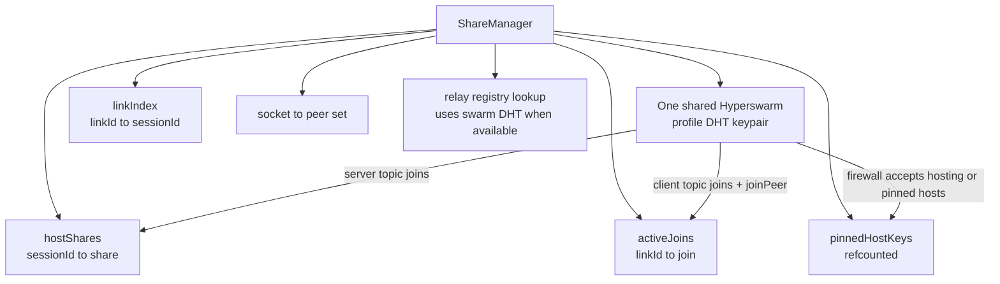

The `ShareManager` maintains several internal mappings: `hostShares` maps
session identifiers to hosted-share state; `activeJoins` maps link
identifiers to viewer join state; `linkIndex` maps a link identifier to the
session it represents; `pinnedHostKeys` tracks which remote host DHT
identities are currently allowed; and per-socket peer state tracks the
relationships carried by each network socket. Because one socket may carry
multiple session relationships — and both host and viewer roles — peer state
cannot be stored per socket; it is scoped to the pair `(socket, linkId)`.

Key decisions:

- Hosting and joining share the same swarm and DHT keypair.
- Host-side routing never uses `peerInfo.topics`.
- Protomux channel identity routes sessions:
  `protocol = zbterm/ctl`, `id = linkId`.
- A single socket may carry multiple sessions and both host/viewer roles.
- Peer state is per `(socket, linkId)`, not per socket.
- Hypercore replication is attached in the Protomux pair callback, after the
  channel id identifies the target session.
- Viewer-side host pinning is explicit: before sending `join-request`, the
  viewer checks `socket.remotePublicKey === invite.hostDhtKey`.
- The union firewall remains defense in depth:
  accept if hosting anything or the remote key is in `pinnedHostKeys`.
- `hostDhtKey` is mandatory in invites; unpinnable links are rejected.
- `pinnedHostKeys` is updated before `joinPeer` or topic dial, because the
  Hyperswarm firewall affects outbound connections too.

### 7.2 Protomux Channel Routing

ZBTerm uses Protomux to carry multiple logical channels over one encrypted
HyperDHT socket. The control protocol is named `zbterm/ctl`, and each
control channel uses the share link identifier as its channel identity: the
protocol identifies the type of channel, and the link ID identifies the
specific shared session.

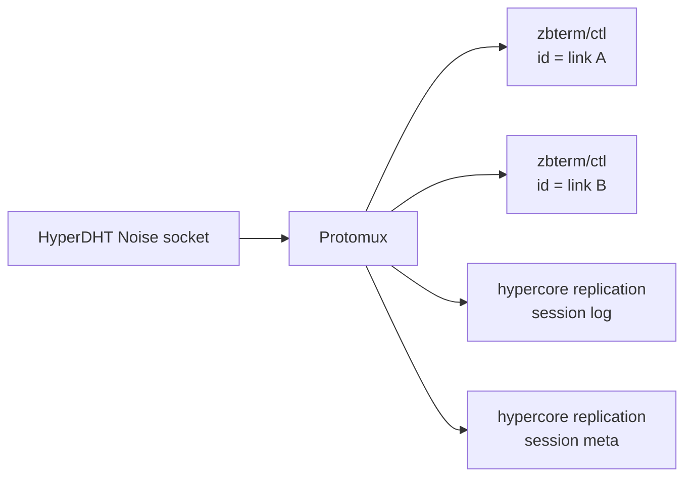

`zbterm/ctl` carries join requests, confirmations, errors, encrypted live
bootstrap/data, sealed input, own-device catalog messages, and session end.
Hypercore replication shares encrypted history and metadata on the same mux.

This design solves a real routing problem: direct `joinPeer` dials do not
reliably expose the topic information needed to tell which hosted session a
connection belongs to, so the host cannot route connections by peer topic
metadata. Instead, the remote peer opens a control channel with a specific
link ID; the host looks up that link ID in its link index, resolves the
correct session and hosted share, and only then attaches the log and
metadata replication streams. A single socket may end up carrying a control
channel for link A, another for link B, and log and metadata replication
streams, with no ambiguity about which is which.

### 7.3 Host-Side Connection Routing

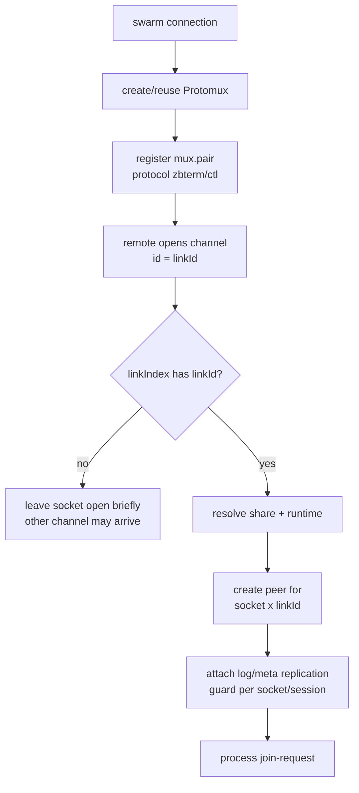

Routing by `peerInfo.topics` is not an option here: it does not behave
reliably for direct `joinPeer` dials, which is exactly the path a viewer
with an invite takes.

### 7.4 Relay Fallback and Registry Lookup

Direct peer-to-peer connectivity may fail because of NAT behavior,
firewalls, or network restrictions. ZBTerm therefore supports an optional
blind relay fallback. The relay never needs access to terminal plaintext; it
forwards already-encrypted streams between peers.

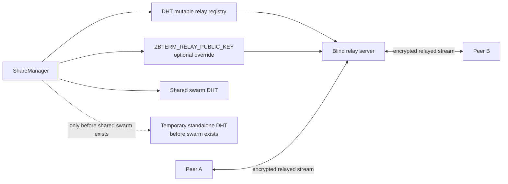

The relay identity may be configured through the environment override
`ZBTERM_RELAY_PUBLIC_KEY`; otherwise ZBTerm discovers relay information
through a mutable DHT registry record. Once the profile swarm exists, the
`ShareManager` reuses the shared swarm's DHT for this lookup; a temporary
standalone DHT is used only if relay lookup must occur before the shared
swarm exists.

Relay fallback is offered if forced or if any active join has waited past
the fallback window. A join started while another join is already past that
window may get relay fallback early. Direct connection attempts and relay
attempts race; direct hole-punching can still win and take over the
connection.

## 8. Session Lifecycle and Data Flow

### 8.1 Host Session Creation

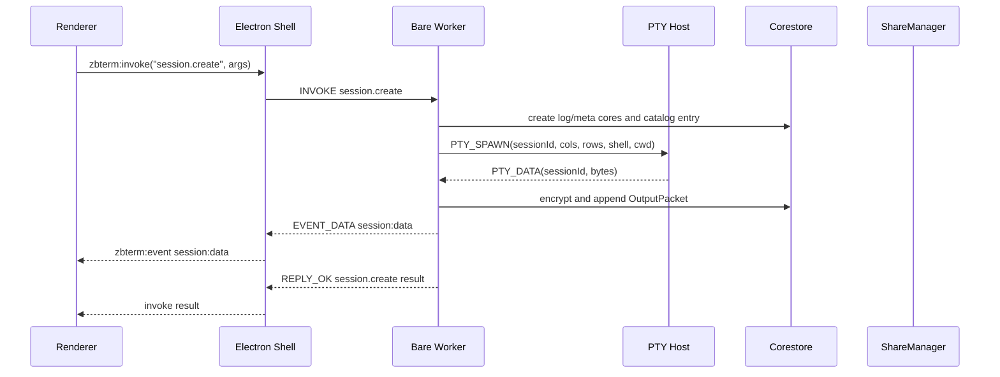

The worker creates the session log and metadata cores and a catalog entry,
then requests a PTY spawn from the shell, which launches `node-pty` with the
configured shell, working directory, and dimensions. When the PTY produces
output, the shell sends a binary PTY-data frame to the worker, which
encrypts the output and appends an `OutputPacket` to the Hypercore log,
emits the data to the local renderer through a binary event, updates its
headless terminal mirror for snapshots, and may send encrypted live data to
authorized viewers. The local user therefore sees output immediately while
the same bytes become part of the encrypted canonical session history.

### 8.2 Live Output and Backpressure

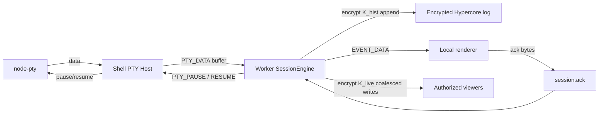

Terminal processes can generate data faster than a renderer, worker, or IPC
connection can consume it, so backpressure is enforced at two levels:

- *Renderer acknowledgment flow control.* The renderer acknowledges bytes it
  has processed; when unacknowledged data exceeds a configured limit, the
  worker requests that the shell pause the PTY, and requests a resume once
  enough bytes are acknowledged.
- *IPC backpressure.* The shell-side PTY host monitors whether the worker can
  drain PTY data from the IPC pipe, and independently pauses the PTY if the
  pipe is congested. This prevents unbounded memory growth in the Electron
  process.

Together these mechanisms propagate pressure back to the source of terminal
output.

> **2026-09-25 (`S-35`, the `ls -R /` flood).** Two more levels exist since the shared-terminal
> flood was fixed. *The core's own backlog:* the renderer acks at once, so the acknowledgment
> limit never engaged while the core's mirror and store fell minutes behind; the PTY is now also
> paused past `engine/index.js::CORE_BACKLOG_LIMIT` (4 MiB not yet through the mirror or into
> the store) and resumed once both are below half (`_updateFlow`, one pause for both reasons;
> `engine/client.js::_setPtyPaused` likewise unions the shell's reasons, so the pipe's drain no
> longer resumes a PTY the core paused). *Viewers:* live output is sent without a queue limit
> on any backend, so a viewer whose channel reports backpressure stops receiving live data and,
> `engine/share-manager.js::LAG_RESYNC_MS` (500 ms) later, is sent the host's current screen
> (a bootstrap capped at `RESYNC_SCROLLBACK` lines) instead of what it missed; a screen that
> meets backpressure too doubles the wait up to `LAG_RESYNC_MAX_MS` (8 s). The viewer's
> recording is unaffected (history replicates separately); only its live view skips ahead.

### 8.3 Remote Terminal Input

Viewer input is treated more carefully than ordinary live output. A viewer
must possess the `SEND_INPUT` capability. Input is sealed to the host device
key, bound to the current epoch, and carries replay-protection counters. The
host validates the capability, epoch, and counter before writing the input
to the local PTY. This prevents unauthorized viewers from controlling the
terminal and prevents captured input messages from being replayed later.

## 9. Sharing and Joining

### 9.1 Share Link Creation

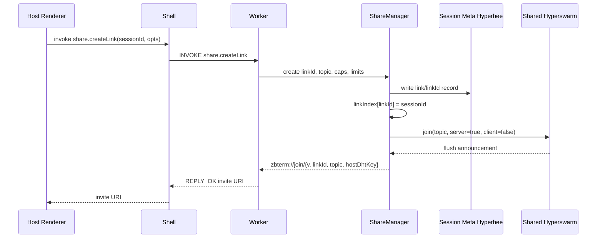

The `ShareManager` creates a link ID, swarm topic, capability set, viewer
limits, and joining rules; writes the link record to the session metadata
Hyperbee; registers the link in the host's link index; and announces the
topic in server mode on the shared swarm. The returned invitation URI
carries a version, the link ID, the swarm topic, and the host's DHT public
key. The `hostDhtKey` is mandatory — a link without it is invalid.

### 9.2 Viewer Join Flow

The viewer join flow is one of the most security-sensitive processes in
ZBTerm.

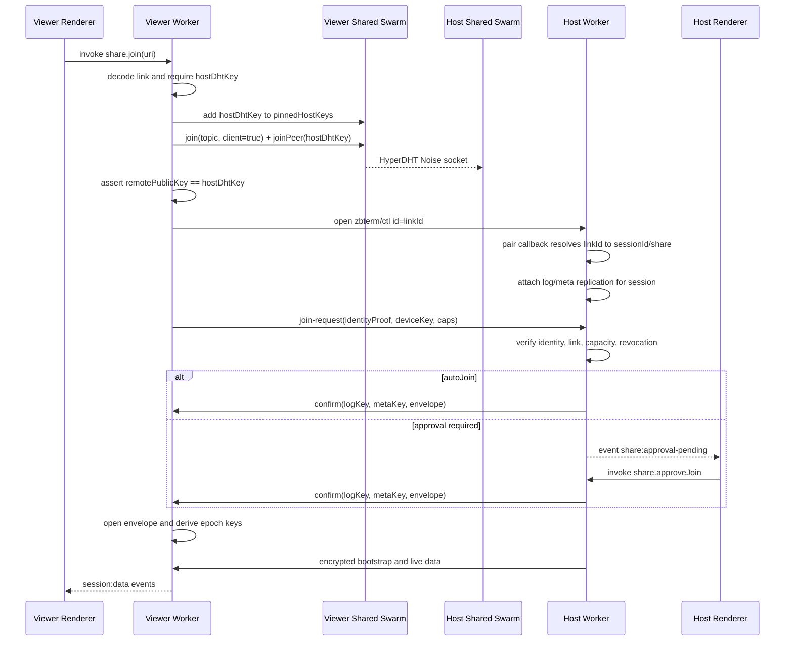

The flow proceeds in stages:

1. **Decode and validate the invitation.** The viewer decodes the invitation
   and requires the host DHT key to be present. The invitation determines
   which swarm topic to use and which host identity to expect.
2. **Pin the host.** Before attempting the connection, the viewer adds the
   expected host DHT key to its pinned host-key set. This must occur before
   joining the topic or dialing, because the Hyperswarm firewall affects
   outbound as well as inbound connections.
3. **Establish the connection.** The viewer joins the topic in client mode
   and may also dial directly via `joinPeer(hostDhtKey)`. When the
   connection is established, the viewer checks that the remote Noise
   public key exactly matches the host DHT key from the invitation. This is
   application-layer host pinning. If the key does not match, the viewer
   must not send identity information or a join request.
4. **Open the control channel.** The viewer opens a `zbterm/ctl` channel
   with the link ID as channel identifier; the host resolves the link ID
   through its link index to determine the intended session.
5. **Attach replication.** Once the session is identified, the host attaches
   replication for the session log and metadata. Replication may begin
   before final approval: this does not reveal readable terminal content,
   because the replicated data is encrypted and the viewer does not yet
   possess the session keys. Hypercore capability checks and encrypted
   session material prevent pre-authorization disclosure; the confirm
   message and key envelope remain post-validation.
6. **Send the join request.** The viewer sends an identity proof, its device
   key, and the requested capabilities. The host verifies the user's
   identity, the device proof, the link status, the requested capabilities,
   viewer capacity, expiration, and revocation state.
7. **Approval.** Links may allow automatic joining; otherwise the host
   renderer receives an approval-pending event, and the host user invokes
   approve or deny.
8. **Confirmation and key delivery.** After approval, the host sends a
   confirmation containing the session replication information and a sealed
   key envelope encrypted to the viewer's device. The viewer opens the
   envelope, derives the epoch keys for its granted capabilities, and then
   receives encrypted bootstrap state and live terminal data, which it
   converts into ordinary session-data events for its local renderer.

## 10. Cryptographic Model

The cryptographic design uses several distinct key layers: the user identity
key (`keet-identity-key`), the device key attested by the identity, the DHT
keypair used for Noise-authenticated network connections, and the session
epoch master key. For each epoch, the host generates a master key K_e, from
which separate history and live keys are derived: the history key encrypts
stored terminal packets, and the live key encrypts live peer traffic.
Separate derivation limits cross-purpose key reuse.

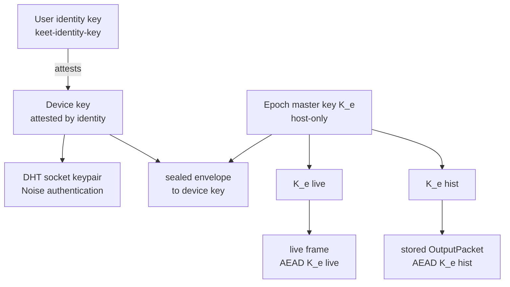

### 10.1 Authenticated Encryption and Associated Data

Encrypted packets use authenticated encryption with associated data (AEAD).
The associated data binds `sessionId`, `epoch`, `seq`, and the sender device
key to the ciphertext. An encrypted packet therefore cannot be moved into
another session, another epoch, another sequence position, or another sender
context: even when the ciphertext is unchanged, authentication fails if the
bound context is incorrect.

### 10.2 Device Envelopes

The host seals epoch key material separately for each authorized device. An
envelope may contain a live key, a history key, or both, and history keys
are omitted when `READ_HISTORY` is not granted. A device granted only
live-view access receives live key material but no history key, so
replicated terminal history remains unreadable to it.

### 10.3 Sensitive Sessions

Sensitive sessions use stricter envelope handling: their envelopes are not
persisted in replicated metadata. Instead, epoch keys are requested through
the live connection and kept only in memory, reducing the amount of
recoverable key material present in replicated storage.

### 10.4 Revocation and Forward Security

When a member, link, or device is revoked, the host rotates to a new epoch,
and new key envelopes exclude the revoked device, which therefore cannot
decrypt future data. This is forward-secure revocation. No system can force
a viewer to forget plaintext it has already seen, and ZBTerm makes no such
claim: revocation protects future epochs, not already-disclosed information.

### 10.5 Invariants

- Epoch master keys are generated by the host.
- History and live keys are derived separately.
- Packet AEAD associated data binds `sessionId`, `epoch`, `seq`, and sender
  device key.
- Envelopes are sealed per recipient device and optionally omit history keys
  when `READ_HISTORY` is not granted.
- Revocation is forward-secure: new epochs and future envelopes exclude
  revoked devices, but already-seen plaintext cannot be clawed back.
- Sensitive sessions do not persist envelopes in replicated metadata; epoch
  keys are requested live and kept in memory.

## 11. Recording, Snapshots, and Playback

Playback combines encrypted Hypercore history, metadata, local snapshots,
and a headless terminal emulator (`@xterm/headless`). A terminal is not
simply a text log: its visible state depends on control sequences, cursor
movement, screen clearing, resizing, colors, alternate screens, and other
stateful operations. Seeking to a point in time therefore requires replaying
terminal operations into an emulator.

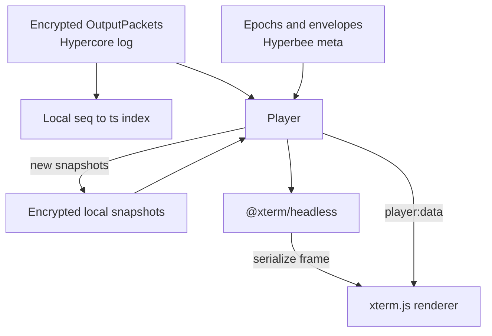

Playback is sparse and local-first: the player avoids loading or replaying
the entire history when unnecessary, maintaining local snapshots and
sequence-to-time indexes. To seek, the player finds the nearest local
snapshot before the target sequence, restores it into the headless terminal,
decrypts and applies the remaining packets up to the target, serializes the
reconstructed terminal state, and swaps it into the visible terminal. The
first playback pass builds snapshots and indexes as it proceeds, so future
seeks can begin from nearby snapshots rather than replaying the entire
session.

## 12. Worker Crash Recovery

The worker may crash, become unresponsive, or exceed an invocation timeout.
The Electron shell supervises it.

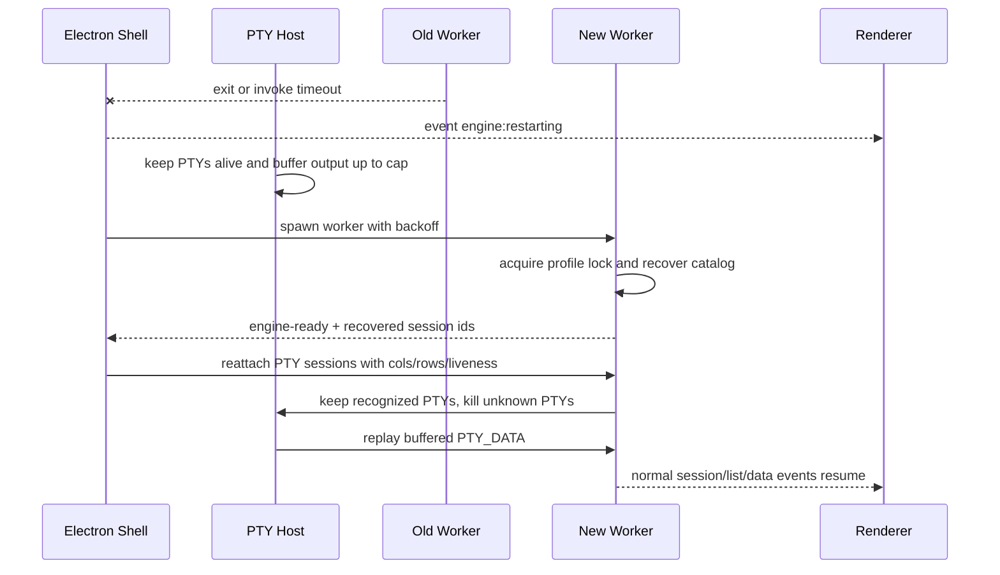

When a failure is detected, the shell emits an engine-restarting event to
the renderer. The native PTY processes remain alive because they are owned
by the shell rather than the failed worker; the shell temporarily buffers
PTY output up to a configured cap. It then starts a new worker with restart
backoff. The new worker acquires the profile lock, recovers the catalog and
session state, and reports the sessions it recognizes; the shell reattaches
the surviving PTY processes to those sessions. Recognized PTYs are retained,
unknown PTYs are terminated, and buffered PTY output is replayed to the new
worker before normal session events resume.

This recovery path is one of the strongest practical benefits of keeping
`node-pty` in the shell: a worker crash does not terminate the user's shell
processes.

Restart policy:

- At most three automatic restarts per 60 seconds.
- Beyond the limit, the shell surfaces a fatal `engine:error` and returns to
  a profile-required state instead of crash-looping.
- PTYs survive because they live in the shell.
- Swarm connections and in-flight join approvals are lost, matching
  whole-app restart semantics but scoped to the worker.
- Viewers are not auto-reconnected by this architecture.

## 13. Security Boundaries and Invariants

### 13.1 Trust Boundaries

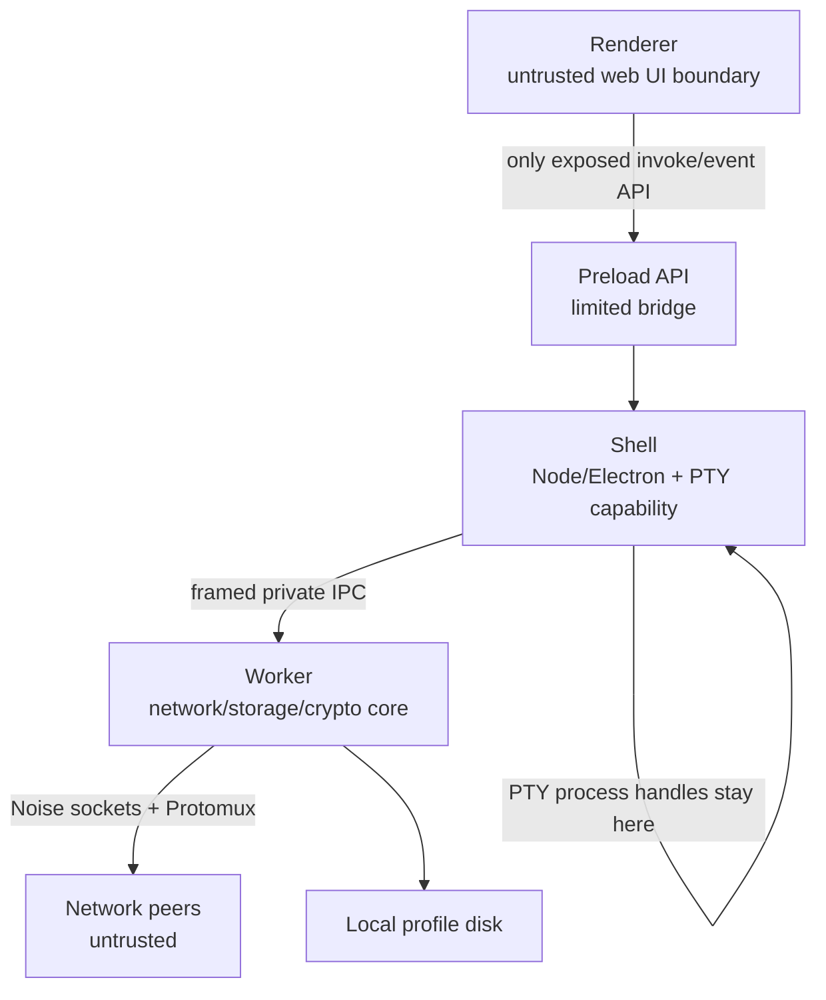

The renderer is treated as an untrusted web user-interface boundary and
communicates only through the limited preload API. The shell owns native
application and PTY capabilities and communicates with the worker over a
private framed IPC protocol. The worker owns network, storage, replication,
session authorization, and cryptography. Network peers are untrusted.
Profile storage is local but contains encrypted and security-sensitive
state.

The main capability split is intentional: network-facing parsing,
replication, sharing, and crypto run in the worker, while process-spawning
PTY capability remains in the shell behind a narrow session-addressed API.
The debug server is loopback-only and uses the same engine seam as the
renderer.

The architecture applies both logical and cryptographic authorization. The
host checks whether a viewer is authorized, but even a viewer that obtains a
network socket or replicated encrypted data gains no confidentiality unless
it received the correct cryptographic key envelope. The central security
principle: *socket access is not equivalent to data access.* Key
distribution is the primary confidentiality mechanism; socket checks and
firewalls are defense in depth.

### 13.2 Core Architectural Invariants

1. One running profile owns one core engine and one shared swarm.
2. The Bare worker owns the profile lock, account state, stores, crypto,
   sessions, playback, and sharing.
3. `node-pty` remains in the Electron shell.
4. All PTY operations cross a narrow, session-addressed protocol.
5. The renderer-facing invoke-and-event contract remains stable.
6. The host is the only writer of canonical session history and metadata.
7. The link ID, not swarm topic metadata, routes a connection to a hosted
   session.
8. The viewer verifies that the connected host DHT key matches the key in
   the invitation.
9. The host DHT key must be pinned before dialing.
10. History confidentiality is enforced through key distribution.
11. Revocation protects future epochs but cannot erase already-viewed
    plaintext.
12. One IPC pipe preserves event ordering.

### 13.3 Invitation Trust and Impersonation (TODO!)

Part of this is now answered by §6.3: a peer that proves a provider account is
shown as `user@github`, everyone else is shown as `@UNKNOWN`, and a peer whose
claim fails outright is refused before the join is ever offered for approval.
What follows is what remains.

**TODO!** Invitation to a session is a security risk. A malicious sender may
impersonate someone you know and trust, share the keyboard with you, and ask
you to log in somewhere where you type a password — and the host-side program
may proxy and/or record your keystrokes.

We must help the user detect suspicious invites by displaying:

- The session name as set by the user.
- The username and hostname of the inviting user.

Additional required protections:

- If an attempt is made to reuse a one-time key that was sent to a user by
  another user, the originating user must be reported.
- Likewise, when a key was sent to a known user and a different user tries to
  connect with that key, the host must be notified.

## 14. Design Decisions and Tradeoffs

| Decision | Rationale |
| --- | --- |
| Use channel id routing instead of topic metadata | Direct `joinPeer` dials do not reliably expose topic routing information |
| Make `linkId` the Protomux channel id | Allows one socket to carry multiple sessions and avoids duplicate unkeyed channels |
| Keep one shared swarm per profile | Aligns with Pear architecture and avoids multiple DHT nodes using one keypair |
| Move `ProfileManager` into the worker | Generalizes to future headless entrypoints and avoids shell/worker lock deadlocks |
| Keep PTY in the shell | `node-pty` is not Bare-compatible; network-facing core also loses process-spawn capability |
| Preserve `invoke(method,args)` | Avoids renderer/debug API churn; hot paths are optimized separately |
| Use binary frames for data and PTY traffic | Avoids base64/JSON overhead for terminal data |
| Use one IPC pipe | Preserves ordering between data and lifecycle events |
| App-layer host pinning plus union firewall | Exact per-join host verification with firewall defense in depth |
| Require `hostDhtKey` in links | Every join must be pinnable before sending identity material |
| One engine implementation, worker-only | No in-process twin of the engine to keep in sync; the test gates carry the risk instead |

Several of these decisions trade simplicity in one place for complexity in
another. One shared swarm per profile reduces duplicated DHT state but makes
routing more complex, since a single socket may represent multiple sessions;
that complexity is absorbed by Protomux channel identifiers. Keeping the
renderer API stable reduces application churn but requires the shell to
translate between renderer requests and worker frames. JSON keeps
low-frequency control operations simple and debuggable, while binary frames
keep the hot paths cheap. One ordered pipe simplifies ordering reasoning but
means all traffic shares one backpressure domain. Permitting replication
before join approval improves connection setup and Hypercore integration,
with confidentiality retained because readable key material is not delivered
until authorization completes. Keeping PTYs alive during worker failure
improves resilience at the cost of reattachment, buffering, and recognition
logic. Finally, having exactly one engine implementation — worker-only, with
no in-process variant — avoids the slow divergence that two parallel
implementations always develop; the test suite carries that risk instead.

## 15. Testing and Verification

An architecture with this many moving parts is only as good as the checks
that keep it honest. The gates that must stay green:

- `npm test` — the unit and integration suite, including RPC schema
  round-trip and garbage-input tests for the shell/worker seam.
- `node test/debug-server-e2e.js` — end-to-end coverage through the debug
  REST API.
- Multi-hosted-session e2e: several sessions hosted concurrently on one
  shared swarm.
- Worker crash/restart e2e: PTY survival, reattachment, and buffered replay.
- Adversarial e2e: wrong host keys, and concurrent hosting plus joining on
  the same profile.
- Identity e2e (`node test/debug-server-e2e.js --identity-only`): three app
  instances against a stubbed `.keys` endpoint — a host that proves its
  provider account, a viewer that verifies it, and a host whose claim names a
  key the provider does not publish and whose join must be refused.
- Manual smoke: create a session, share it, join from another profile,
  revoke, play back, and inspect diagnostics.

## 16. Known Non-Goals

A few things are out of scope on purpose:

- Viewers do not auto-reconnect after a host or worker restart; they rejoin
  through the normal join flow.
- There is no per-session "stop hosting and leave topic" command.
- Non-host admins do not rotate keys in v1. Every action that affects
  confidentiality is executed by the host.

## Appendix A. Development Reference

### A.1 Scripts

| Script | Runs |
| ------ | ---- |
| `npm start` | `electron-forge start -- --no-updates` |
| `npm test` | `brittle-node test/*.test.js` |
| `npm run test:debug-server` | `node test/debug-server-e2e.js` |
| `npm run lint` | `prettier --check .` + `lunte` |
| `npm run format` | `prettier --write .` + `lunte --fix` |
| `npm run package` | `electron-forge package` (no distributables) |
| `npm run make` | `electron-forge make` (build distributables) |
| `npm run build:relay` | `node scripts/build-relay.js` (standalone relay executables) |
| `./build_all.sh` | Builds everything: relay executables (all platforms) + GUI app package (all platforms) + GUI installer for the host platform only. `--relay-only`, `--gui-only`, `--no-make` narrow it down. |

### A.2 Peer-to-Peer OTA Updates

ZBTerm is built on `pear-runtime` and can be staged, provisioned and
multisig'd for peer-to-peer distribution the same way any Pear/Electron app
can — see the [pear-runtime docs](https://docs.pears.com) and the
[Electron Forge Pear plugin](https://www.electronforge.io) for the
stage/provision/multisig release flow, signing (macOS notarization, Windows
code signing), and store submission (Flathub, Snap Store) if you need to set
up a production release pipeline. That flow is generic to any Pear/Electron
app and isn't specific to ZBTerm. Development builds keep the Pear OTA
updater wiring intact, but `npm start` passes `--no-updates` by default.

> **2026-09-19 (`D-08`).** This section is historical. ZBTerm no longer depends on
> `pear-runtime` and has no peer-to-peer OTA updater in any build: `workers/main.js`,
> `electron/updater-available.js`, `pear.json` and `package.json#upgrade` were deleted, and
> `forge.config.js` no longer reads `UPGRADE_KEY` or requires `pear-link`. `--no-updates` is
> still accepted and does nothing. The only update mechanism is the npm registry check on npm
> installs (`electron/update-channel.js`, `renderer/app.js::wireNpmUpdater`).

### A.3 Code Pointers

- Share control protocol and relay/registry lookup:
  `engine/share-manager.js` (including the hardcoded, non-secret
  `REGISTRY_PUBLIC_KEY` used to resolve the default relay).
- Permission capability bitmask definitions: `engine/caps.js`.
- Identity claim/challenge byte formats and SSHSIG handling:
  `engine/identity/claim.js`; verification rules: `engine/identity/verify.js`;
  provider registry: `engine/identity/providers.js`; the shell-side capabilities
  they drive: `electron/ssh-keys.js` and `electron/github-keys.js`.
