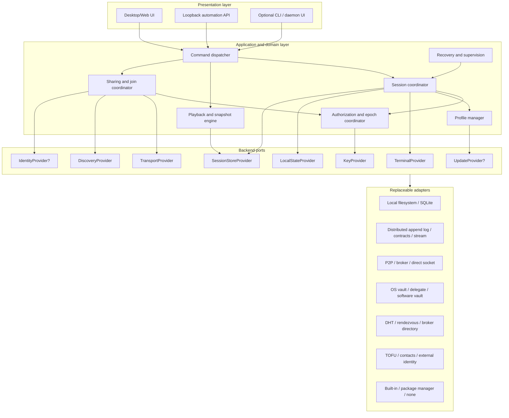
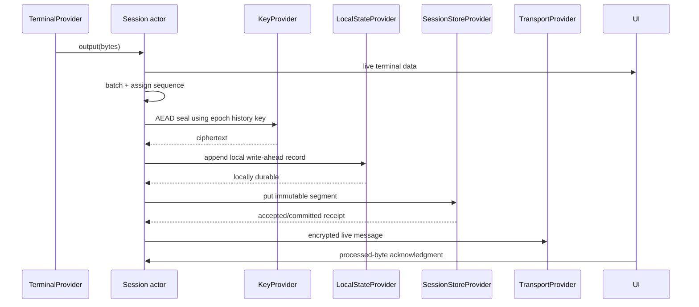
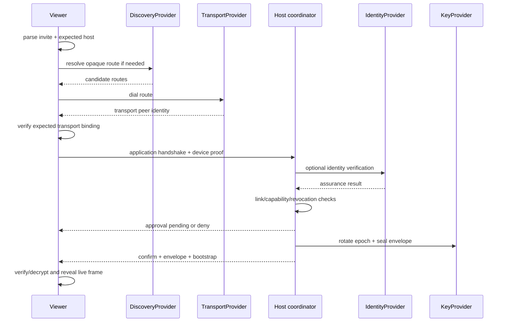
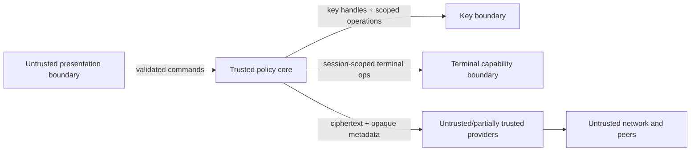
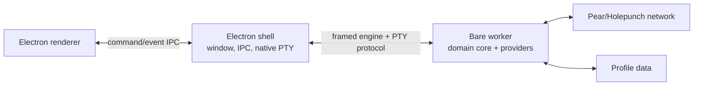
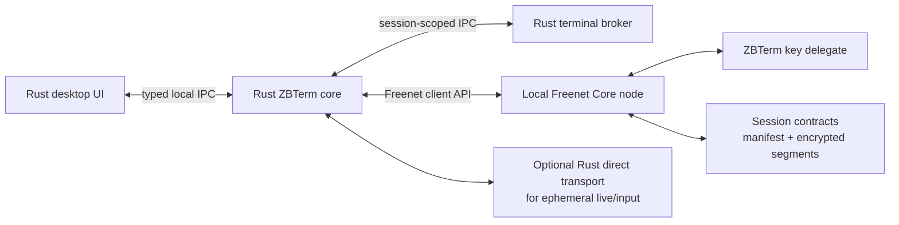
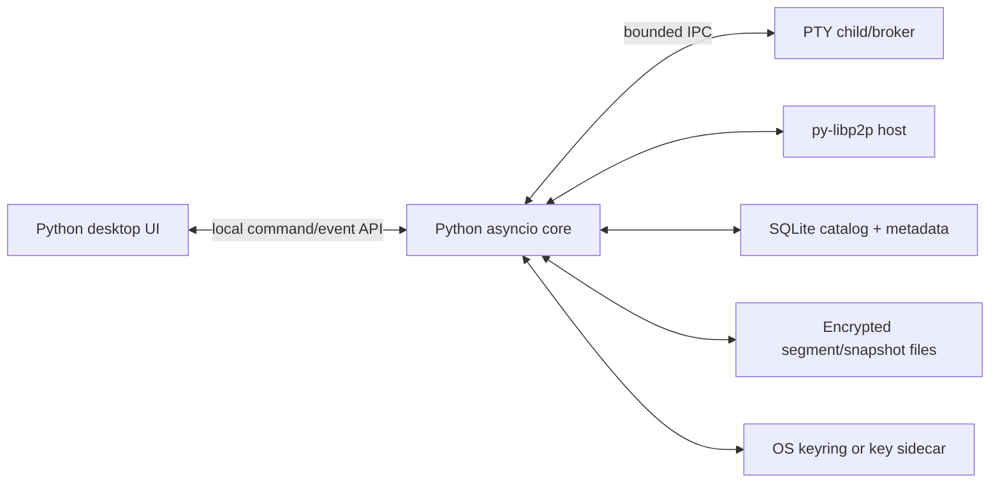
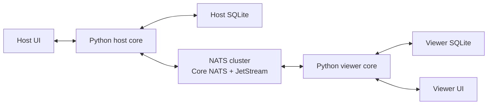

# Pluggable Infrastructure Architecture

## 0. Purpose

This document re-imagines ZBTerm as a portable terminal-recording and
terminal-sharing application whose product behavior is independent of any one
language, storage engine, distributed network, identity system, process model,
or update mechanism.

It complements:

- [terminal-share-requirements.md](terminal-share-requirements.md), which
  defines product and security requirements; and
- [ARCHITECTURE.md](ARCHITECTURE.md), which documents the existing
  Node/Pear implementation.

The design has two goals:

1. Keep terminal, playback, authorization, encryption, and UI behavior stable.
2. Make infrastructure choices replaceable through narrow, capability-aware
   backend interfaces.

The examples in Part III are high-level designs, not commitments. The Freenet,
py-libp2p, NATS, and SQLite notes were checked against their official
documentation on 2026-07-25. These projects evolve; an implementation must pin
versions and repeat compatibility tests.

---

# Part I — The architecture of the application

## 1. Architectural principles

### 1.1 Product invariants stay above infrastructure

The application core, not a provider, owns these invariants:

- the host is the sole canonical session writer;
- terminal packets have a stable sequence and hash chain;
- live and history keys are separate;
- authorization is capability-based;
- input is encrypted to the host and is not recorded as input history;
- revocation rotates future keys;
- stored and distributed terminal data is encrypted by the application;
- snapshots are derived caches, never canonical history;
- reconnect, duplicate delivery, and out-of-order delivery cannot corrupt the
  session;
- live viewing and playback are distinct UI modes;
- viewers never gain rights merely because a transport connection succeeded.

An infrastructure provider may add authentication, encryption, replication,
ordering, or retention, but the core must not silently rely on those properties
unless the provider advertises them and the selected deployment policy requires
them.

### 1.2 Providers expose capabilities, not brands

The core asks for capabilities such as:

- append immutable encrypted segments;
- read a sparse sequence range;
- open an authenticated byte stream;
- advertise and resolve an opaque route;
- sign with a non-exportable key;
- resolve an optional user identity;
- check and stage a signed update.

It does not ask for a named database, network, or identity product.

### 1.3 Local safety does not depend on distributed availability

The host must be able to:

- run its terminal;
- record encrypted history locally;
- render live output locally;
- finalize a session; and
- recover after a crash

even when distributed infrastructure is unavailable. A provider outage may
prevent sharing or remote replication, but must not destroy the local terminal
or canonical log.

### 1.4 Application encryption is end-to-end

Storage and transport providers receive ciphertext and authenticated metadata.
Provider-managed TLS, disk encryption, access-control lists, or private
subjects are defense in depth, not substitutes for session encryption.

### 1.5 Optional providers have explicit null behavior

Identity management and software updates are optional:

- without an identity provider, the application still has device keys and can
  use anonymous bearer links;
- without an update provider, the application reports that updates are managed
  externally;
- without discovery, an invitation must contain a complete dial route;
- without distributed history storage, sharing may be live-only and history
  remains local;
- without an ephemeral bidirectional transport, viewer input must be disabled
  rather than written into a persistent message store.

## 2. Layered architecture



Dependencies point inward:

- adapters know the backend interfaces;
- the application knows only interfaces and domain types;
- the UI knows commands, replies, and events;
- no provider type appears in a domain entity or UI contract.

## 3. Major application components

### 3.1 Presentation

The presentation layer:

- renders session lists, dialogs, terminal frames, and playback state;
- sends typed commands;
- consumes an ordered event stream;
- never holds long-term private key material;
- never writes distributed storage directly;
- never interprets provider-specific connection objects.

Desktop, browser, CLI, and daemon interfaces may coexist. They must use the
same application command surface.

### 3.2 Command dispatcher

The dispatcher is the stable façade for all entry points. It:

- validates command schemas;
- assigns correlation and idempotency identifiers;
- applies profile and session scope;
- invokes the appropriate coordinator;
- converts internal failures into stable error codes;
- emits progress independently from final command completion.

The command model remains equivalent to the session, player, profile, account,
share, preference, update, and diagnostics families in the requirements.

### 3.3 Session coordinator

The session coordinator owns:

- terminal creation and lifecycle;
- canonical packet numbering;
- data and resize packetization;
- normal/HD batching;
- local rendering events;
- history append queues;
- live fan-out;
- output acknowledgments and backpressure;
- snapshot scheduling;
- session finalization and extension.

It has one authoritative in-memory actor/task per live session. All mutations
for a session pass through that actor, even if the selected storage provider
offers multi-writer transactions.

### 3.4 Playback engine

The playback engine owns:

- sparse history reads;
- packet decryption and validation;
- sequence-to-time indexing;
- nearest-snapshot selection;
- terminal-state reconstruction;
- seek cancellation and stale-result suppression;
- timed playback and gap compression;
- progressive history availability.

The terminal emulator used for reconstruction must match the visible terminal's
control-sequence semantics closely enough for deterministic frames.

### 3.5 Sharing and join coordinator

The sharing coordinator owns:

- link creation, consumption, capacity, and revocation;
- invitation encoding/decoding;
- discovery publication and resolution;
- expected-host binding;
- application-level handshake;
- join approval;
- capability grants;
- connection/session multiplexing;
- bootstrap, timeline, snapshot, and live-data messages;
- reconnect and catch-up policy;
- viewer disconnect and cleanup.

Transport identity and application identity are separate. The handshake binds
them for the lifetime of a joined relationship.

### 3.6 Authorization and epoch coordinator

This component owns:

- member and device capability state;
- epoch transitions;
- history grants for prior epochs;
- per-device key envelopes;
- input policy;
- immediate revocation;
- sensitive-session key retention policy;
- admin authorization and audit events.

It calls a key provider through opaque key handles. Providers do not decide
authorization.

### 3.7 Profile manager

Each profile owns:

- a profile lock;
- local account and device references;
- provider configuration;
- local catalog, indexes, and snapshots;
- durable preferences;
- one logical backend bundle;
- window/debug configuration.

Different profiles may select different provider bundles. A migration tool can
therefore copy a session from one backend to another through the neutral export
format.

### 3.8 Recovery supervisor

The supervisor:

- starts provider processes or sidecars when configured;
- monitors the session engine;
- preserves or pauses terminal processes during engine recovery;
- bounds buffered output;
- reattaches recognized terminal processes;
- restarts providers according to policy;
- reports degraded capability rather than pretending the full backend is ready.

## 4. Canonical domain model

Provider implementations must preserve these logical types even if their
physical schemas differ.

### 4.1 Identifiers

| Type | Meaning |
| --- | --- |
| `ProfileId` | Local profile namespace |
| `SessionId` | Cryptographically bound logical session identity |
| `DeviceId` | Application device public-key fingerprint |
| `UserId` | Optional identity-provider subject |
| `MemberId` | Stable application member reference |
| `LinkId` | Random share-link identifier |
| `EpochId` | Monotonic key generation within a session |
| `SegmentId` | Hash of an immutable packet segment |
| `RequestId` | Idempotency/correlation identifier |

IDs crossing an interface are opaque byte strings with a canonical text
encoding. Code must not infer provider names, paths, or subject syntax from
them.

### 4.2 Output packet

```text
OutputPacket {
  schema_version: u32
  session_id: SessionId
  epoch: u64
  sequence: u64
  timestamp_ms: i64
  kind: DATA | RESIZE | MARKER
  columns?: u32
  rows?: u32
  flags: bitset
  previous_packet_hash: bytes
  ciphertext: bytes
  packet_hash: bytes
}
```

The authenticated encryption associated data includes every field except the
ciphertext and packet hash. The packet hash covers the complete encoded packet.
`previous_packet_hash` makes provider reordering or equivocation detectable.

### 4.3 Immutable segment

Providers may batch packets into:

```text
PacketSegment {
  schema_version: u32
  session_id: SessionId
  first_sequence: u64
  last_sequence: u64
  previous_segment_hash: bytes
  packets: [OutputPacket]
  writer_device: DeviceId
  writer_signature: bytes
}
```

Segment bytes are canonical. Re-uploading the same `SegmentId` is idempotent.
Two different segments claiming the same sequence interval are a security
error, not a merge choice.

### 4.4 Session manifest

```text
SessionManifest {
  schema_version: u32
  session_id: SessionId
  owner_device: DeviceId
  name: string
  created_at_ms: i64
  current_epoch: u64
  committed_head_sequence: u64
  committed_head_hash: bytes
  segment_refs: [SegmentRef]
  member_policy_head: bytes
  flags: SessionFlags
  revision: bytes
}
```

On an eventually consistent backend, `committed_head_sequence` is derived from
the highest contiguous, valid, owner-signed segment chain. A provider's
last-write-wins register must never override that derivation.

### 4.5 Authorization records

Membership, link, epoch, envelope, revocation, and admin operations are signed,
versioned records. Their order is an authenticated per-session policy chain.
Providers may store them as rows, key/value records, log messages, or mergeable
contract entries.

### 4.6 Snapshots

Snapshots contain:

- session and sequence;
- terminal rows/columns;
- serialized terminal state;
- timestamp and HD state;
- the packet/segment hash at the snapshot point;
- local encryption metadata.

A snapshot received from another peer is untrusted until its referenced packet
chain is verified. It is always safe to discard and rebuild.

## 5. Core workflows

### 5.1 Host output



The local durable append precedes a claim that history is recorded.
Distributed commit may lag and is reported separately.

### 5.2 Viewer join



### 5.3 Playback seek

1. Resolve target timestamp to the nearest known sequence.
2. Ask the history provider for availability and missing ranges.
3. Select the nearest verified local snapshot at or before the target.
4. Read, validate, and decrypt the remaining packet range.
5. Apply packets to a headless terminal.
6. Discard the result if a newer seek superseded it.
7. Atomically swap the visible frame and update the playhead.

## 6. Process division

The architecture supports three deployment shapes.

### 6.1 Single process

Suitable for prototypes and trusted local-only use:

```text
UI + application core + providers + terminal host
```

Risks:

- a UI or network parser compromise reaches terminal and key capabilities;
- blocking provider work can affect terminal latency;
- native crashes take down all functions.

### 6.2 Split desktop application

Recommended general desktop shape:

```text
UI process
  ↕ stable command/event IPC
core process
  ↕ narrow terminal protocol
terminal broker
  ↕ provider RPC/FFI
optional provider sidecars
```

The core owns profiles, session state, authorization, and provider composition.
The terminal broker owns native terminal handles. Key operations may run in the
core, OS vault, hardware module, or a separate delegate.

### 6.3 Background daemon

Recommended for detached sessions and cross-device access:

```text
desktop UI / CLI ── authenticated local IPC ── daemon
                                             ├─ terminal broker
                                             ├─ session core
                                             └─ providers
```

The daemon owns profile locks and continues after the UI exits. Local IPC must
authenticate the operating-system user and enforce profile/session scope.

### 6.4 Process rules

- Private keys should exist in the least privileged process able to use them.
- Network parsers should not receive an unrestricted process-spawn interface.
- Terminal operations are addressed by session handle, never arbitrary PID.
- IPC frames are versioned, length-bounded, cancellable, and fuzz-tested.
- Data and lifecycle ordering is preserved across process boundaries.
- Provider sidecar failure produces a degraded provider state, not silent data
  loss.

## 7. Programming-language adaptation

### 7.1 Canonical wire schemas

Control messages and durable records must have a language-neutral schema.
Protocol Buffers, FlatBuffers, or canonical CBOR are viable; the project should
select one after benchmarking. Regardless of encoding:

- field numbers/keys are never reused;
- unknown fields are preserved or ignored according to the schema contract;
- `u64` sequence values never pass through a lossy floating-point type;
- timestamps are signed 64-bit Unix milliseconds;
- byte strings remain bytes, not implicit UTF-8;
- maps used in signatures have canonical ordering;
- maximum sizes and recursion depths are specified;
- every top-level record carries a schema version.

### 7.2 In-process interfaces

Each language maps the neutral interfaces idiomatically:

| Concept | Rust | TypeScript/Node | Python |
| --- | --- | --- | --- |
| Provider | `trait` + `Arc<dyn Trait>` | interface/object | `Protocol`/ABC |
| Async result | `Future<Result<T,E>>` | `Promise<T>` | `Awaitable[T]` |
| Event stream | `Stream<Item=Event>` | async iterator/EventTarget | async iterator |
| Cancellation | token/drop | `AbortSignal` | cancellation scope/task |
| Opaque key | newtype handle | branded value | frozen dataclass |
| Bytes | `Bytes`/`Vec<u8>` | `Uint8Array`/Buffer | `bytes`/memoryview |

### 7.3 Cross-language providers

A provider implemented in another language runs as a sidecar by default.
The sidecar protocol uses the same framed command/event model as the core.

Avoid exposing language runtimes directly through FFI for asynchronous,
long-lived providers. If FFI is necessary:

- expose a small C ABI;
- use opaque integer handles;
- make ownership and buffer lifetime explicit;
- never unwind exceptions/panics across the boundary;
- translate callbacks onto the host event loop;
- provide explicit cancel and close calls;
- test ABI compatibility for every supported platform.

### 7.4 Concurrency adaptation

The session actor model is portable:

- Rust: one Tokio task per live session with bounded channels;
- Node: one logical actor/queue per session, optionally in a worker;
- Python: one asyncio task group per session, with CPU-heavy terminal replay in
  a worker process or native extension.

Provider callbacks never mutate session state directly. They enqueue typed
events to the owning actor.

## 8. Security boundaries



Provider-specific authentication cannot replace the application handshake.
For example:

- a libp2p Peer ID is not automatically a ZBTerm user;
- a NATS user JWT is not automatically a session member;
- a Freenet contract subscriber is not automatically authorized to decrypt;
- a storage ACL does not replace per-device envelopes.

## 9. Reliability and observability

Every provider reports:

- lifecycle state: starting, ready, degraded, stopping, stopped;
- capability set and limits;
- health and last successful operation;
- queue depth and backpressure;
- durability/replication lag;
- connection and retry state;
- structured error category;
- safe diagnostics with secrets redacted.

The core publishes one aggregate readiness document. “Ready” is scoped:

- `terminal_ready`;
- `local_recording_ready`;
- `history_distribution_ready`;
- `live_sharing_ready`;
- `discovery_ready`;
- `identity_ready`;
- `updates_ready`.

---

# Part II — Backend interface definition

## 10. Interface conventions

The following pseudocode is language-neutral. All fallible calls return
`Result<T, BackendError>`. All blocking work is asynchronous. Streams are
bounded and cancellable.

### 10.1 Common provider lifecycle

```text
interface Provider {
  describe() -> ProviderDescriptor
  start(context: ProviderContext) -> ProviderState
  health() -> HealthReport
  stop(deadline: Instant) -> void
}

ProviderDescriptor {
  provider_id: string
  provider_version: string
  interface_version: u32
  capabilities: set<Capability>
  limits: map<string, scalar>
}

ProviderContext {
  profile_id: ProfileId
  profile_path: LocalPath
  config: OpaqueConfig
  event_sink: BackendEventSink
  cancellation: CancellationToken
}
```

Startup fails if the interface major version is incompatible. A missing optional
capability disables the associated feature or selects a documented fallback.

### 10.2 Idempotency and cancellation

Every mutating call accepts:

- `request_id`, stable across retries;
- an optional deadline;
- a cancellation token.

Cancellation means “the caller no longer waits,” not necessarily “the provider
rolled back.” The caller resolves final state using the request ID.

### 10.3 Durability levels

```text
Durability =
  MEMORY_ACCEPTED
  LOCAL_DURABLE
  PROVIDER_COMMITTED
  REPLICATED { copies: u32 }
```

Providers must not report a stronger level than they can prove.

### 10.4 Stable errors

```text
BackendErrorCode =
  INVALID_ARGUMENT
  NOT_FOUND
  ALREADY_EXISTS
  CONFLICT
  UNAUTHORIZED
  FORBIDDEN
  KEY_UNAVAILABLE
  CORRUPT
  UNSUPPORTED
  UNAVAILABLE
  TIMEOUT
  RATE_LIMITED
  STORAGE_FULL
  CANCELLED
  INTERNAL
```

Errors include provider ID, retryability, safe details, and an optional cause
chain. Secret material and plaintext terminal output are never included.

## 11. Backend bundle

```text
interface BackendBundle : Provider {
  terminal() -> TerminalProvider
  local_state() -> LocalStateProvider
  session_store() -> SessionStoreProvider
  keys() -> KeyProvider
  transport() -> TransportProvider?
  discovery() -> DiscoveryProvider?
  identity() -> IdentityProvider?
  updates() -> UpdateProvider?
}
```

Providers can be mixed. A “Freenet bundle,” for example, may use Freenet for
history/discovery, an OS vault for keys, and a direct QUIC adapter for ephemeral
live input.

`BackendBundle.start` validates cross-provider compatibility:

- shared crypto-suite support;
- route encoding;
- maximum message and segment sizes;
- required sparse-read behavior;
- whether viewer input has a non-persistent path;
- identity-to-device binding;
- update signing policy.

## 12. TerminalProvider

```text
interface TerminalProvider : Provider {
  spawn(request_id, spec: TerminalSpec) -> TerminalHandle
  attach(request_id, recovery: RecoveryToken) -> TerminalHandle
  write(handle, bytes) -> void
  resize(handle, columns: u32, rows: u32) -> void
  pause(handle) -> void
  resume(handle) -> void
  terminate(handle, mode: GRACEFUL | FORCE) -> ExitStatus
  inspect(handle) -> TerminalStatus
  events(handle) -> stream<TerminalEvent>
}

TerminalSpec {
  session_id: SessionId
  executable?: LocalPath
  arguments: [string]
  working_directory?: LocalPath
  environment_policy: EnvironmentPolicy
  columns: u32
  rows: u32
}

TerminalEvent =
  DATA { bytes }
  RESIZED { columns, rows }
  EXITED { code?, signal?, timestamp_ms }
  ERROR { BackendError }
```

The provider returns a recovery token that is meaningful only to the terminal
broker. The core never receives arbitrary process handles.

## 13. LocalStateProvider

This mandatory provider stores profile-local state.

```text
interface LocalStateProvider : Provider {
  acquire_profile_lock(owner: ProcessIdentity) -> ProfileLease
  renew_profile_lock(lease) -> void
  release_profile_lock(lease) -> void

  get_preference(key) -> bytes?
  put_preference(request_id, key, value, expected_revision?) -> Revision

  list_catalog(query: CatalogQuery) -> [SessionCard]
  get_catalog(session_id) -> SessionCard?
  put_catalog(request_id, card, expected_revision?) -> Revision
  delete_catalog(request_id, session_id) -> void

  append_recovery_record(request_id, record) -> Durability
  scan_recovery_records(session_id, after) -> stream<RecoveryRecord>
  compact_recovery_records(session_id, through) -> void

  put_snapshot(request_id, snapshot) -> void
  nearest_snapshot(session_id, at_or_before_sequence) -> Snapshot?
  list_snapshots(session_id) -> [SnapshotRef]
  delete_snapshots(session_id) -> void
}
```

The local recovery log bridges the gap between terminal output and a slower or
temporarily unavailable distributed provider.

## 14. SessionStoreProvider

This provider stores and optionally distributes canonical encrypted history and
session metadata.

```text
interface SessionStoreProvider : Provider {
  create_session(request_id, genesis: SessionGenesis) -> StoreSession
  open_session(session_id, mode: OWNER | REPLICA | READ_ONLY) -> StoreSession
  close_session(handle) -> void
  delete_local(request_id, session_id) -> void

  put_segment(request_id, handle, segment: PacketSegment) -> CommitReceipt
  has_segment(handle, segment_id) -> bool
  read_segments(handle, range: SequenceRange) -> stream<PacketSegment>
  availability(handle, range?: SequenceRange) -> Availability
  watch_head(handle, after_revision?) -> stream<HeadEvent>

  get_manifest(handle) -> SessionManifest
  publish_manifest(request_id, handle, manifest, expected_revision?) -> CommitReceipt

  put_policy_record(request_id, handle, record: SignedPolicyRecord) -> CommitReceipt
  read_policy_records(handle, after?) -> stream<SignedPolicyRecord>

  put_envelope(request_id, handle, recipient, epoch, envelope) -> CommitReceipt
  list_envelopes(handle, recipient) -> [EnvelopeRecord]

  truncate_owner_history(request_id, handle, through_policy_record) -> CommitReceipt
  export_session(handle, options) -> stream<PortableArchiveChunk>
  import_session(request_id, chunks) -> StoreSession
}
```

### 14.1 Required semantics

- `put_segment` is idempotent by segment hash.
- The provider may return before global replication, but the receipt states the
  achieved durability.
- `read_segments` may yield gaps only if `availability` reports them.
- The core validates signatures, sequence continuity, hashes, epochs, and
  ciphertext before use.
- Eventual backends may ignore optimistic manifest revision and merge immutable
  records instead; they advertise `EVENTUAL_MERGE`.
- A provider cannot claim secure erasure of replicas it does not control.

### 14.2 Storage capabilities

```text
LOCAL_ONLY
DISTRIBUTED
SPARSE_READ
HEAD_WATCH
ATOMIC_COMPARE_AND_SET
EVENTUAL_MERGE
SERVER_ORDERED
RANGE_DELETE
REPLICA_COUNT
CONTENT_ADDRESSING
```

The core requires local durability and ordered reconstruction. It does not
require global linearizability.

## 15. KeyProvider

Keys are referenced by opaque handles.

```text
interface KeyProvider : Provider {
  supported_suites() -> [CryptoSuite]

  generate_signing_key(request_id, policy: KeyPolicy) -> KeyRef
  generate_encryption_key(request_id, policy: KeyPolicy) -> KeyRef
  import_wrapped_key(request_id, wrapped, policy) -> KeyRef
  public_key(key_ref) -> PublicKey
  delete_key(request_id, key_ref) -> void

  random_bytes(length) -> bytes
  sign(key_ref, domain, message) -> Signature
  verify(public_key, domain, message, signature) -> bool

  derive_key(parent_ref, suite, context, policy) -> KeyRef
  aead_seal(key_ref, nonce, associated_data, plaintext) -> bytes
  aead_open(key_ref, nonce, associated_data, ciphertext) -> bytes
  seal_to_recipient(recipient_public_key, domain, plaintext) -> bytes
  open_recipient_envelope(local_key_ref, domain, envelope) -> bytes

  set_retention(key_ref, retention: PERSISTENT | SESSION | MEMORY_ONLY) -> void
  attest_key(key_ref, challenge) -> KeyAttestation?
}
```

`KeyPolicy` states exportability, user-presence requirements, retention, and
profile/session scope. Sensitive sessions request memory-only epoch keys.

The session manifest names the crypto suite. A viewer must reject a session
whose suite is unsupported; silent downgrade is forbidden.

## 16. TransportProvider

The transport carries ephemeral control, live output, bootstrap, and input.

```text
interface TransportProvider : Provider {
  bind(request_id, bind_spec: BindSpec) -> Listener
  listener_routes(listener) -> [TransportRoute]
  accept(listener) -> stream<Connection>
  dial(request_id, routes, expected_peer?) -> Connection
  close_listener(listener) -> void
  diagnostics(scope?) -> TransportDiagnostics
}

interface Connection {
  transport_peer() -> TransportPeer
  open_stream(protocol_id, stream_key) -> DuplexByteStream
  accept_streams() -> stream<IncomingStream>
  path() -> DIRECT | RELAY | BROKER | LOCAL
  close(reason) -> void
}

interface DuplexByteStream {
  send(frame: bytes) -> void
  receive() -> stream<bytes>
  half_close() -> void
  close() -> void
}
```

### 16.1 Required transport properties

- Frames are length-bounded.
- Backpressure is observable.
- Multiple logical session streams may share a connection.
- The connection exposes an authenticated transport peer when supported.
- The application handshake still verifies device/user proofs.
- Reconnect creates a new connection and resumes from application sequence.
- Duplicate paths racing the same host are deduplicated above the provider.

### 16.2 Capabilities

```text
AUTHENTICATED_PEER
MULTIPLEXED_STREAMS
ORDERED_STREAM
EPHEMERAL_DELIVERY
DIRECT_DIAL
NAT_TRAVERSAL
RELAY
BROKERED
PATH_MIGRATION
```

`EPHEMERAL_DELIVERY` is required for viewer input under the default security
policy. A persistent broker stream does not satisfy it.

## 17. DiscoveryProvider

```text
interface DiscoveryProvider : Provider {
  publish(request_id, advert: SignedAdvertisement, ttl) -> Publication
  refresh(publication, ttl) -> void
  withdraw(request_id, publication) -> void
  resolve(request_id, query: DiscoveryQuery) -> [SignedAdvertisement]
  watch(query) -> stream<DiscoveryEvent>
}
```

Advertisements contain opaque transport routes, expected host transport key,
application host device key, expiry, and signature. They contain no session
plaintext or epoch keys.

Implementations include DHT records, rendezvous services, broker key/value
entries, local-network discovery, direct invitations, or a null provider.

## 18. IdentityProvider

Identity is optional and augments the mandatory device-key model.

```text
interface IdentityProvider : Provider {
  local_subject() -> IdentitySubject?
  attest_device(request_id, device_public_key) -> DeviceAttestation
  verify_device(attestation, expected_subject?) -> IdentityAssurance

  resolve_identity(request_id, locator) -> IdentityCard?
  verify_external_proof(request_id, proof) -> IdentityAssurance

  list_contacts(filter?) -> [Contact]
  request_contact(request_id, identity) -> ContactRequest
  accept_contact(request_id, request) -> Contact
  list_groups() -> [Group]
}

IdentityAssurance {
  subject?: UserId
  level: ANONYMOUS | TOFU | CONTACT | SAME_USER_DEVICE | EXTERNAL_VERIFIED
  issuer: string
  claims: map<string, string>
  expires_at_ms?: i64
  revocation_status: GOOD | REVOKED | UNKNOWN
}
```

The core displays the assurance level and applies session policy. An identity
provider never returns private keys.

The null identity provider returns `ANONYMOUS` and lets the key provider create
a self-signed device identity.

## 19. UpdateProvider

```text
interface UpdateProvider : Provider {
  current_version() -> Version
  check(channel) -> UpdateCandidate?
  verify(candidate, policy: UpdateTrustPolicy) -> VerificationReport
  stage(request_id, candidate) -> StagedUpdate
  apply(request_id, staged, restart_policy) -> ApplyResult
  rollback(request_id, target) -> ApplyResult
  events() -> stream<UpdateEvent>
}
```

Update metadata is signed independently of its transport. The provider must
enforce anti-rollback policy and report whether rollback is available.

The null provider reports `EXTERNALLY_MANAGED`. Operating-system package
managers can therefore own updates without special UI logic.

## 20. Backend event contract

```text
BackendEvent =
  PROVIDER_STATE
  TERMINAL_EVENT
  HISTORY_HEAD_CHANGED
  HISTORY_AVAILABILITY_CHANGED
  TRANSPORT_PATH_CHANGED
  INCOMING_CONNECTION
  DISCOVERY_CHANGED
  IDENTITY_CHANGED
  UPDATE_AVAILABLE
  DIAGNOSTIC
  ERROR
```

Every event includes provider ID, profile, monotonic local event number,
timestamp, optional session/request scope, and safe structured details.

Events from multiple providers do not imply global ordering. The application
actor assigns domain ordering before forwarding UI events.

## 21. Portable archive and migration

A backend-independent archive contains:

- session manifest and schema version;
- immutable encrypted segments;
- signed policy chain;
- recipient envelopes selected by export policy;
- optional encrypted snapshots;
- integrity index;
- provider-neutral metadata.

It never contains unwrapped epoch keys by default. Import verifies every hash
and signature before publishing to the target provider.

Migration modes:

- **copy:** keep source and target;
- **move local cache:** delete source only after target verification;
- **re-home canonical host:** requires a signed ownership/provider-transition
  record and is a separate security-sensitive operation.

---

# Part III — Four high-level designs

## 22. Example A — Node + Pear stack

This example describes the existing architecture through the new interfaces.
It remains a valid provider bundle rather than the definition of the product.

### 22.1 Process topology



### 22.2 Provider mapping

| Interface | Adapter |
| --- | --- |
| `TerminalProvider` | Native PTY broker in the Electron shell |
| `LocalStateProvider` | Profile files, catalog, encrypted snapshot cache |
| `SessionStoreProvider` | Per-session append log plus structured metadata store |
| `KeyProvider` | Software key vault backed by current crypto libraries |
| `TransportProvider` | Encrypted peer sockets with logical stream multiplexing |
| `DiscoveryProvider` | Topic/DHT discovery, direct peer dial, optional relay |
| `IdentityProvider` | Current identity/device key implementation; partial UI |
| `UpdateProvider` | Pear update worker |

### 22.3 Adapter behavior

- The append log maps packets one-to-one or in small segments.
- Structured metadata maps manifests, epochs, envelopes, links, and members.
- The transport adapter maps one logical protocol stream per link/session.
- Discovery invitations include topic/route and expected host transport key.
- The shell/worker framed protocol implements the neutral backend sidecar
  contract.
- Existing renderer commands and events become the application façade.

### 22.4 Strengths

- Proven by the current code and tests.
- Efficient append and sparse replication.
- Direct peer transport with relay fallback.
- Native terminal isolated from network/storage logic.
- Existing packaging and update path.

### 22.5 Risks and cleanup needed

- Product semantics are currently intertwined with concrete storage/network
  APIs in the sharing and store implementations.
- Identity and device-management features are incomplete in the UI.
- The software key vault exposes more key material to the core process than a
  delegate or OS keystore design.
- Provider interfaces should first be introduced around the existing behavior,
  with golden protocol tests, before replacing any infrastructure.

## 23. Example B — Rust + Freenet

> **2026-09-18.** A spike that implements the network-facing part of this design in the
> existing Node/Bare core is planned in
> [`projects/260918_backend-abstraction/`](projects/260918_backend-abstraction/). It signs the
> hybrid mode of §23.6 (`D-01` in [`decisions.md`](decisions.md)) and deviates from Part II in
> three places: one `ShareBackend` object in place of separate transport, discovery and
> session-store providers; JSON-message channels in place of `DuplexByteStream`; and history
> calls that operate on Hypercores, not backend-neutral segments.
>
> **2026-09-18 (B9).** The spike is done. The Freenet adapter design that came out of it is
> [`projects/260918_backend-abstraction/freenet-backend-design.md`](projects/260918_backend-abstraction/freenet-backend-design.md),
> grounded in the measurements in `probes.md` beside it. The three deviations are recorded as
> assumptions in that project's `QnA_assumptions.md` and in the header of
> `engine/backends/types.js`: **A-3** (one `ShareBackend` object, not the three providers of
> §23.3), **A-10** (a channel carries JSON messages, not a `DuplexByteStream`) and **A-11**
> (history calls operate on a `SessionStore`'s Hypercores, not on the neutral segments of §4.3
> and §23.4). Two further departures from this section come from the measurements: the direct
> transport of §23.6 is WebRTC in the **host process** of the existing Node/Bare application,
> not a Rust adapter, because WebRTC does not work under Bare (`S-06`, `D-06`); and offline
> history from a segment contract (§23.4) is an open problem there, because a read-only
> Hypercore replica cannot be fed from contract bytes (design §8.2). The §23.8 gates for
> segment rate and summary/delta size were not measured.

### 23.1 Current Freenet model

Freenet applications are divided into:

- **contracts**, which hold public replicated state and define validation and
  merge behavior;
- **delegates**, which run locally, hold private state/secrets, and communicate
  by messages; and
- **UIs**, which communicate with a local Freenet node through a client SDK.

Contract state is eventually consistent and must support order-independent
merging through summaries and deltas. The official Rust contract interface
therefore exposes state validation, state update, state summary, and state
delta operations. See the official
[Freenet component overview](https://freenet.org/build/manual/components/overview/),
[contract documentation](https://freenet.org/build/manual/components/contracts/),
[delegate documentation](https://freenet.org/build/manual/components/delegates/),
and [contract interface](https://freenet.org/build/manual/contract-interface/).

This is a materially different model from a mutable append-only database.

### 23.2 Recommended topology



The desktop application can be native Rust. It talks to a locally running
Freenet Core node using the supported Rust networking/client facilities or a
versioned sidecar adapter. A browser-served Freenet UI is possible, but a native
terminal application still needs a privileged local terminal broker.

### 23.3 Provider mapping

| Interface | Adapter |
| --- | --- |
| `TerminalProvider` | Rust terminal broker using platform PTY APIs |
| `LocalStateProvider` | SQLite or an embedded Rust database plus encrypted files |
| `SessionStoreProvider` | Freenet session/segment contracts |
| `KeyProvider` | Freenet delegate, optionally backed by OS/hardware keys |
| `TransportProvider` | Contract subscriptions for durable updates; recommended direct Rust transport for ephemeral live/input |
| `DiscoveryProvider` | Contract keys and signed discovery contracts |
| `IdentityProvider` | Optional Ghostkeys/contact delegate or application identity |
| `UpdateProvider` | Signed Freenet web/container distribution for UI assets; signed native updater or OS package manager for binaries |

### 23.4 Contract data design

Mutable `head = N` state is unsafe under order-independent merge. Instead:

```text
SessionContractState {
  genesis: SignedGenesis
  segments: Set<SegmentId -> SignedEncryptedSegment>
  policy_records: Set<RecordId -> SignedPolicyRecord>
  envelope_records: Set<RecordId -> RecipientEnvelope>
  tombstones: Set<SignedTombstone>
}
```

Merge is set union. Validation requires:

- the session owner signature on segments;
- canonical segment hash;
- no two non-identical segments with the same owner sequence interval;
- a valid previous-segment hash;
- valid signed policy records;
- envelopes addressed to a member/device authorized by the policy chain.

The readable head is the highest contiguous valid owner-signed chain, not the
largest claimed number. Revocation is a new policy record and epoch; tombstones
can hide data from current state but cannot promise network-wide erasure.

For scale, immutable segment payloads may live in per-segment contract
instances, with a mergeable manifest containing their keys and hashes. The
design must not require one contract to read another during validation unless
the pinned Freenet version supports it. Each segment remains independently
verifiable from its signature and hash.

State summaries should compactly describe known segment and policy IDs; deltas
contain missing immutable entries. This maps naturally to Freenet's documented
summary/delta synchronization model.

### 23.5 Delegate design

The ZBTerm delegate:

- owns the user/device and envelope private keys;
- signs session genesis, segments, policy changes, and invitations;
- opens per-device envelopes;
- derives live/history keys;
- enforces memory-only retention for sensitive sessions;
- prompts for high-risk operations where appropriate.

Freenet documentation states that delegates keep private data behind a message
boundary and can request trusted-shell user consent. It also states that
cross-device synchronization of delegate private state is not yet implemented.
Consequently, each device must receive its own session envelopes; this design
must not assume delegate secrets automatically follow a user to another device.

### 23.6 Live output and input

Two modes are possible:

**Freenet-only mode**

- Batch encrypted output into contract deltas.
- Subscribe to contract updates for near-live viewing.
- Use the same entries as durable history.
- Disable viewer input unless the pinned Freenet release provides a verified
  non-persistent, authenticated remote delegate message path.

Writing terminal input into a durable contract, even encrypted, violates the
default requirement that viewer input not be stored. The adapter must not hide
that mismatch.

**Recommended hybrid mode**

- Use Freenet contracts for durable encrypted history, membership, discovery,
  invitations, and offline catch-up.
- Put direct ephemeral live output and input on a small Rust transport adapter
  such as authenticated QUIC/WebRTC.
- Bind the direct route and peer key into the signed Freenet invitation/contract.
- Fall back to contract subscription for read-only delayed viewing when direct
  connectivity fails.

The provider abstraction is what makes this hybrid possible without changing
session or UI logic.

### 23.7 Updates

Freenet can distribute web UI assets through web-container contracts. Native
desktop and terminal-broker binaries require either:

- a signed native update manifest transported through Freenet; or
- an external operating-system package manager.

Contract/delegate upgrades require explicit state and secret migration plus
anti-rollback validation; they cannot be treated as a code-only replacement.

### 23.8 Risks and validation gates

- Benchmark contract-update latency and sustainable encrypted segment rate.
- Benchmark state-summary/delta size for long terminal sessions.
- Verify contract size/resource limits and sharding behavior.
- Pin Freenet Core and SDK versions; the client and delegate APIs are evolving.
- Prove that segment merge is associative, commutative, and deterministic.
- Fuzz contract state validation and migration.
- Decide whether read-only Freenet-only mode is an acceptable degraded mode.

## 24. Example C — Python + py-libp2p

### 24.1 Current py-libp2p capabilities

The py-libp2p project describes its core as stable while still progressing
toward full production maturity. Its current feature table includes TCP, QUIC,
WebSocket, Noise/TLS, Yamux/Mplex, Kademlia DHT, mDNS, rendezvous, GossipSub,
circuit relay v2, hole punching, AutoNAT, and Bitswap. See the official
[py-libp2p repository](https://github.com/libp2p/py-libp2p) and
[documentation](https://py-libp2p.readthedocs.io/).

The architecture must pin a tested release and run interoperability tests; it
must not assume feature parity with every other libp2p implementation.

### 24.2 Topology



For robust terminals, replay, and crypto throughput, the PTY broker and
terminal-state emulator may be Rust extensions or sidecars while orchestration
remains Python.

### 24.3 Provider mapping

| Interface | Adapter |
| --- | --- |
| `TerminalProvider` | POSIX PTY/Windows pseudoconsole adapter, preferably isolated |
| `LocalStateProvider` | SQLite in WAL mode plus encrypted snapshot files |
| `SessionStoreProvider` | Local content-addressed encrypted segments; Bitswap/custom range protocol for replication |
| `KeyProvider` | OS keyring, hardware-backed helper, or encrypted software vault |
| `TransportProvider` | py-libp2p custom protocols over secure multiplexed streams |
| `DiscoveryProvider` | Kademlia provider records, rendezvous, mDNS, direct multiaddrs |
| `IdentityProvider` | Device key/Peer ID binding plus optional contacts service |
| `UpdateProvider` | Signed Python/native bundle updater or external package manager |

### 24.4 Protocol layout

Use distinct libp2p protocol IDs:

```text
/zbterm/control/1
/zbterm/live/1
/zbterm/input/1
/zbterm/history/1
/zbterm/diagnostics/1
```

One secure libp2p connection may carry multiple streams. Every stream begins
with a session/link binding and application handshake. Noise/TLS authenticates
the libp2p peer, while ZBTerm verifies the device/user proof and invitation.

Recommended use:

- control stream: joins, approvals, rekeys, metadata, disconnect;
- live stream: bootstrap and encrypted output;
- input stream: encrypted monotonic viewer input;
- history stream or Bitswap: immutable segment retrieval;
- DHT/rendezvous: discover route candidates;
- mDNS: optional same-LAN discovery;
- circuit relay/hole punching: connectivity fallback.

GossipSub may announce signed session-card or availability changes, but should
not carry private terminal data or be the canonical ordered log.

### 24.5 Storage and replication

SQLite stores:

- session catalog;
- manifest and policy index;
- segment availability;
- link/member state;
- preferences and profile state.

Immutable encrypted segment bytes are content-addressed files or SQLite blobs.
A custom block store can expose them to Bitswap. The owner publishes a signed
manifest; viewers request missing segment hashes and validate the chain.

SQLite WAL mode allows readers and a writer to operate concurrently, but still
has one writer and is a same-host mechanism. Long reads can delay checkpoints.
The adapter therefore:

- uses one database writer task;
- keeps transactions short;
- checkpoints deliberately;
- never places a WAL database on a network filesystem;
- reports disk-full and checkpoint lag.

See SQLite's official [WAL documentation](https://www.sqlite.org/wal.html).

### 24.6 Python concurrency

- One asyncio task group owns each live session.
- Network handlers decode bounded frames then enqueue them.
- One SQLite writer task serializes mutations.
- CPU-heavy encryption may use optimized native libraries.
- Terminal reconstruction runs in a worker process/native module to avoid
  blocking network and PTY loops.
- All queues are bounded and propagate pause/resume to the PTY.
- Task cancellation closes streams, releases store handles, and preserves
  locally durable recovery records.

### 24.7 Risks

- py-libp2p is still approaching full production maturity.
- Python scheduling and garbage collection may increase terminal-tail latency.
- Bitswap is content retrieval, not a session authorization system; encrypted
  blocks and per-device keys remain mandatory.
- DHT/provider records leak some traffic metadata.
- Interoperability must be tested against at least one non-Python libp2p node.

## 25. Example D — Python + NATS JetStream + SQLite

This design is distributed but brokered rather than peer-to-peer. It is useful
for teams or deployments willing to operate/trust NATS infrastructure for
availability and metadata privacy while retaining application-level
end-to-end encryption.

### 25.1 Topology



### 25.2 Provider mapping

| Interface | Adapter |
| --- | --- |
| `TerminalProvider` | Isolated Python/native PTY broker |
| `LocalStateProvider` | Per-profile SQLite in WAL mode |
| `SessionStoreProvider` | Host SQLite canonical log plus JetStream encrypted history stream |
| `KeyProvider` | Local OS vault or encrypted software vault |
| `TransportProvider` | NATS subjects and request/reply; JetStream where persistence is allowed |
| `DiscoveryProvider` | Signed invitation plus restricted JetStream KV route entry |
| `IdentityProvider` | Optional mapping from NATS NKey/JWT subject to application identity |
| `UpdateProvider` | Signed manifest/object through JetStream or external package manager |

### 25.3 Subject design

Use opaque, random subject components:

```text
pt.<deployment>.<route>.control
pt.<deployment>.<route>.live
pt.<deployment>.<route>.history
pt.<deployment>.<route>.meta
pt.<deployment>.<route>.input.<host-inbox>
```

The invitation contains server/account information, route identifier, expected
host application key, and link secret. Subject knowledge is not authorization.

NATS account/user permissions should restrict publish and subscribe patterns,
but every application payload remains encrypted and signed.

### 25.4 History and live output

The host first commits encrypted packets to SQLite, then publishes immutable
segments to JetStream with:

- session and sequence headers;
- segment hash;
- stable application message ID for deduplication;
- ciphertext payload.

JetStream publication acknowledgments establish `PROVIDER_COMMITTED`.
Configured stream replication may establish a stronger receipt.

Viewers use pull consumers for history and explicit application acknowledgments
after validation/local commit. Starting sequence supports sparse catch-up.
At-least-once redelivery is expected, so segment hashes and request IDs make
processing idempotent.

JetStream stores messages and can replay them; consumers track delivery and
acknowledgments. Pull consumers are recommended by NATS for scalable flow
control. See the official [JetStream overview](https://docs.nats.io/nats-concepts/jetstream),
[stream documentation](https://docs.nats.io/nats-concepts/jetstream/streams),
and [consumer documentation](https://docs.nats.io/nats-concepts/jetstream/consumers).

Two live modes are possible:

- consume the same JetStream history stream near its head, simplifying
  ordering; or
- use Core NATS for lower-latency encrypted live output and JetStream for
  durable history, with a signed sequence barrier joining bootstrap to live.

The first is simpler. The second needs careful gap recovery from JetStream.

### 25.5 Input must remain ephemeral

Viewer input uses Core NATS request/reply or an uncaptured subject:

1. viewer seals input to the host;
2. viewer sends a request with a unique reply inbox and timeout;
3. host validates identity, epoch, capability, policy, and counter;
4. host writes to the terminal and returns an acknowledgment.

No JetStream stream may capture the input subject. Server configuration and
tests must prove that wildcard stream subjects do not include it.

Core NATS is at-most-once, so an input acknowledgment may be lost. Automatic
retransmission is unsafe for keystrokes unless the host deduplicates the
monotonic input counter. The application may retry only with the exact same
counter and payload.

NATS implements request/reply using publish/subscribe and unique inbox subjects;
it can also report that no responder exists. See the official
[request/reply documentation](https://docs.nats.io/nats-concepts/core-nats/reqreply).

### 25.6 Metadata, discovery, and objects

- JetStream KV can hold short-lived signed route advertisements, link state
  hints, or provider configuration.
- Watchers can notify clients of route changes.
- Large encrypted snapshots or update bundles may use Object Store.
- Session authorization records remain signed application records even when KV
  compare-and-set is used.

NATS documents KV watch/history and atomic create/update operations. Its Object
Store chunks large objects but explicitly is not itself a general distributed
storage system; objects must fit the backing filesystem. See
[JetStream KV](https://docs.nats.io/nats-concepts/jetstream/key-value-store/kv_walkthrough)
and [Object Store](https://docs.nats.io/nats-concepts/jetstream/obj_store).

### 25.7 NATS identity and authorization

NATS can authenticate clients using TLS certificates, NKeys, JWTs, or an
authentication callout. Subject permissions and accounts provide useful
defense in depth.

An optional identity adapter may verify an NATS user JWT/NKey and bind its
public subject to a ZBTerm device/user record. That binding must be explicit:
a valid NATS user is not automatically a member of any terminal session.

NATS JWT security uses an operator/account/user trust hierarchy and NKey
challenge signatures; private NKeys are not stored by the server. See the
official [NATS security overview](https://docs.nats.io/nats-concepts/security)
and [JWT security documentation](https://docs.nats.io/running-a-nats-service/nats_admin/security).

### 25.8 SQLite role

Host SQLite is the immediate canonical local database:

- packets and resize events;
- append queue and publication state;
- manifests and policies;
- catalog and preferences;
- snapshot index;
- NATS consumer/publisher checkpoints.

Viewer SQLite stores validated encrypted replicas and playback indexes.

WAL mode permits concurrent readers while the single writer appends. The
application owns checkpoint scheduling and keeps the database on local disk.
JetStream is not used as the only local recovery source.

### 25.9 Failure behavior

| Failure | Behavior |
| --- | --- |
| NATS unavailable | Host terminal and SQLite recording continue; sharing is degraded |
| Publish ack lost | Retry same message ID; reconcile by segment hash |
| Duplicate history message | Idempotently ignore after hash validation |
| Viewer offline | Durable consumer/range query catches up later |
| Host offline | Available JetStream history remains replayable if keys allow |
| SQLite busy/full | Pause PTY at bounded queue threshold and surface error |
| Input responder absent | Return host unavailable; do not queue input durably |
| NATS credential revoked | Disconnect and re-evaluate application membership |

### 25.10 Tradeoffs

Strengths:

- straightforward Python client APIs;
- durable replay, consumer checkpoints, and clustering;
- operational observability;
- simple multi-device reachability through broker infrastructure;
- SQLite gives strong local recovery and queryability.

Costs:

- requires operated NATS servers and an authentication domain;
- infrastructure sees timing, sizes, subjects, and connection metadata;
- broker authorization and application authorization must remain separate;
- subject and stream configuration mistakes can accidentally persist input;
- server retention limits can delete history earlier than application policy.

## 26. Comparison

| Dimension | Node + Pear | Rust + Freenet | Python + py-libp2p | Python + NATS/SQLite |
| --- | --- | --- | --- | --- |
| Network shape | Direct P2P + relay | Decentralized contract network; optional direct live path | Direct P2P + relay | Brokered/federated |
| Durable history | Distributed append log | Mergeable signed contract segments | Local CAS + peer block exchange | SQLite + JetStream stream |
| Live path | Direct encrypted streams | Contract subscription or hybrid direct transport | Custom libp2p stream | JetStream head or Core NATS |
| Ephemeral input | Direct peer stream | Requires hybrid/verified ephemeral path | Dedicated libp2p stream | Uncaptured Core NATS request/reply |
| Discovery | DHT/topic/invite | Contract key/discovery contract | DHT/rendezvous/mDNS/invite | Signed invite + KV/broker route |
| Key isolation | Software core keys | Freenet delegate | OS vault/sidecar | OS vault/sidecar |
| Identity | Application identity | Optional delegate/Ghostkeys | Peer ID binding + optional provider | Optional NKey/JWT binding |
| Offline history | Yes, with local blocks/keys | Yes, with subscribed contract state/keys | Yes, with local segments/keys | Yes, with SQLite/JetStream/keys |
| Operations burden | Low-to-medium | Local Freenet node and evolving app model | Bootstrap/relay operations | NATS cluster/account operations |
| Main risk | Coupling to current stack | Consistency/latency/API maturity | Python and implementation maturity | Central service dependency/configuration |

## 27. Recommended implementation sequence

1. Freeze canonical domain schemas and create cross-language golden vectors.
2. Extract the current behavior behind `TerminalProvider`,
   `LocalStateProvider`, `SessionStoreProvider`, `KeyProvider`,
   `TransportProvider`, and `DiscoveryProvider`.
3. Build an in-memory reference backend for deterministic tests.
4. Build a local-only backend and prove terminal, recording, playback, crash
   recovery, and migration without networking.
5. Port the application core to Rust while keeping the existing infrastructure
   behind a sidecar adapter, or first refactor the existing core behind the same
   interfaces.
6. Implement one new distributed backend at a time.
7. Run the same conformance suite against every bundle.
8. Add mixed-provider tests, especially storage from one bundle with transport,
   identity, keys, or updates from another.

## 28. Provider conformance suite

Every provider bundle must pass:

- lifecycle and version negotiation;
- request idempotency after timeout/retry;
- cancellation and bounded shutdown;
- packet/segment golden vectors;
- sparse range and availability behavior;
- duplicate, gap, reordering, and equivocation tests;
- crash between local durability and provider commit;
- profile lock and stale-lock recovery;
- key non-exportability and sensitive retention where advertised;
- wrong-host, wrong-epoch, wrong-device, and replayed-input tests;
- backpressure under slow storage and slow viewers;
- reconnect from every sequence boundary;
- provider outage and recovery;
- export/import round trip across two different backends;
- fuzzing of every external frame and durable record;
- safe diagnostics with secret scanning.

## 29. Decision rule

Select providers per deployment, not once for the entire project:

- use direct P2P where server independence and low latency dominate;
- use Freenet where decentralized mergeable shared state and contract
  distribution justify its different consistency model;
- use NATS where an operated broker, observability, and predictable
  cross-network reachability are acceptable;
- use local-only storage for private recording;
- use the strongest available local key boundary independently of the network;
- leave identity and updates optional, but never ambiguous.

The abstraction is successful when changing any one of these choices does not
change packet semantics, authorization rules, playback behavior, or the UI
command contract.
